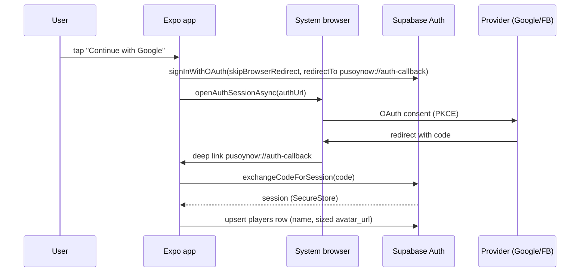
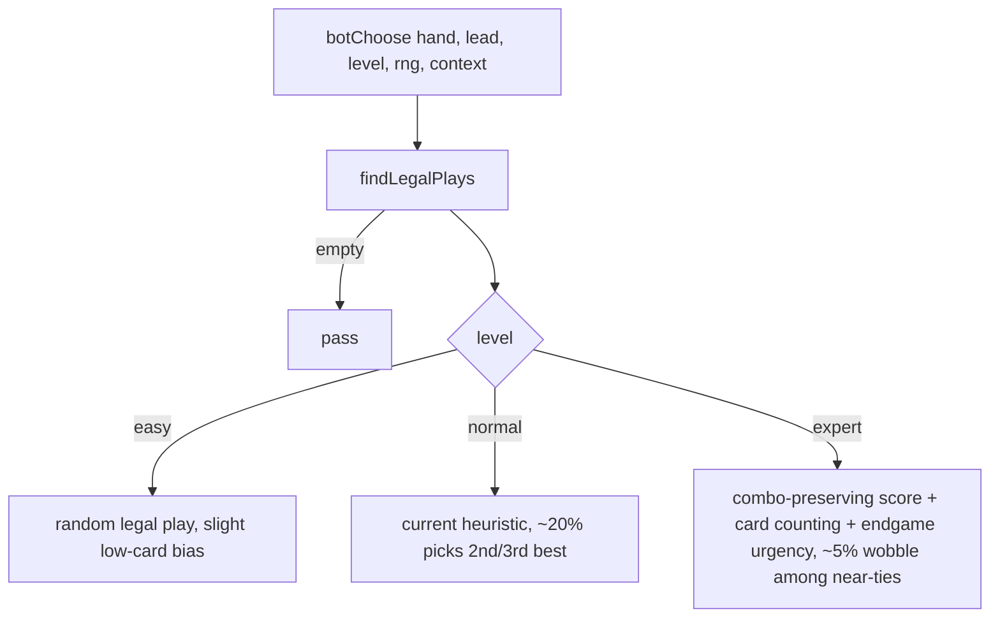

# feat: Visual redesign, social login, and bot difficulty ladder

## Summary

Three tracks that take Pusoy Now from vertical slice to a product-feeling game: a classic playing-card visual identity backed by 4 AI-generated assets, real social login (Google + Facebook now, TikTok via a bridge) so player avatars come from their social profile, and an easy/normal/expert bot ladder with per-move variability. One Expo codebase already serves app and web; nothing here changes that.

---

## Problem Frame

The game logic is solid (engine, legal-play highlighting, auto-pass, sort modes all shipped) but the app looks like a prototype: flat colored rectangles, a code-drawn card back, no identity. Sign-in is a stub with dead buttons. All three bots share one heuristic, so games feel samey and there is no difficulty choice. The stated goals: simple playing-card aesthetic, social login purely for display name + avatar, and bots worth replaying.

---

## Requirements

**Visual**

- R1. Game table, home, bot-select, and sign-in share one classic playing-card theme (deep felt green, paper cream, card red/ink, subtle gold accents). Settings/stats/leaderboard get the palette only, no layout redesign.
- R2. Exactly 4 generated image assets integrated: card back, table felt texture, logo, home hero. Further generations require explicit user approval.
- R3. Card faces stay code-drawn (crisp at small sizes); only the card back becomes an image.
- R4. Shipped UX features keep working: playable-card highlighting, auto-pass, sort cycle, tap-to-skip deal.

**Auth**

- R5. Google and Facebook login work on native and web via Supabase Auth (PKCE); session stored in SecureStore on native (adapter already exists), localStorage on web.
- R6. On first sign-in, a `players` row is upserted with display name and a usable avatar URL (Google sized up with `=s400`; Facebook re-fetched at width 400 via `provider_token` since GoTrue returns a 50px thumbnail).
- R7. Signed-in users see their avatar on home and at their seat in the game; guests get an initial-letter fallback avatar.
- R8. Sign-out works and returns the app to guest state.
- R9. Guests can keep playing bots with no account (unchanged).
- R10. TikTok login via Login Kit + Supabase Edge Function session bridge (stretch; requires TikTok developer app approval). Instagram is dropped: Meta killed consumer Instagram login in Dec 2024, Facebook is the sanctioned Meta substitute.

**Bots**

- R11. Player picks Easy / Normal / Expert before a game; the choice is visible during play (bot name badges).
- R12. Each level has a distinct decision policy with per-move randomness driven by an injectable rng (also makes engine tests deterministic, killing the two known flaky tests).
- R13. Expert is measurably stronger: over 200 seeded simulated games, expert beats easy in at least 70% of head-to-head finishes.

---

## Key Technical Decisions

- **Reuse the bot's `findLegalPlays` as the single legality source for all difficulty levels**: the levels differ only in how they *choose* among legal plays, so difficulty is a scoring policy, not a new engine.
- **Difficulty as a pure function parameter (`level`, `rng`, `context`) rather than bot classes**: keeps `botChoose` testable and the localGame wiring a one-line pass-through.
- **Supabase native providers for Google and Facebook; custom Edge Function bridge for TikTok**: Supabase has no TikTok provider and TikTok is not OIDC-compliant, so the bridge exchanges the Login Kit code server-side and mints a Supabase session with the Admin API. TikTok is its own unit so it can slip without blocking Google/Facebook.
- **Avatar URLs are cached in `players.avatar_url` and refreshed on every sign-in**: Facebook CDN URLs expire, so the row is a cache, not a permanent record.
- **Theme tokens in one module (`lib/theme.ts`) consumed by all screens**: the current screens each carry hardcoded hex values; centralizing is what makes the re-theme land consistently and keeps future changes cheap.
- **Generated assets are static PNGs in `assets/art/`, generated by a one-off script, committed to the repo**: no runtime generation, no CDN. The proven local pipeline (OpenAI image API, key read from the Windows registry, not `$env`) is reused from the pokemon-resume project.
- **UI copy rules**: no em dashes, no emojis in user-facing strings.

---

## High-Level Technical Design

Social login flow (native; web replaces the browser hop with a full-page redirect):

Bot decision ladder (one entry point, three policies):

---

## Scope Boundaries

- **Deferred to follow-up work:** Apple sign-in (mandatory only when shipping social login to the iOS App Store; add at store-submission time), X/Twitter login, per-difficulty stats, online multiplayer wiring, sound design, animations beyond light polish.
- **Outside this round:** Instagram login (no sanctioned consumer API since Dec 2024), monetization, Bluetooth play.

---

## Implementation Units

### U1. Theme foundation

- **Goal:** One theme module and shared UI primitives so every screen draws from the same classic-cards palette.
- **Requirements:** R1
- **Dependencies:** none
- **Files:** `lib/theme.ts` (new), `components/ui.tsx` (new: themed Button, Card panel, ScreenContainer), light refactor of `app/index.tsx`, `app/bot-select.tsx`, `app/sign-in.tsx`, `app/settings.tsx`, `app/stats.tsx`, `app/leaderboard.tsx` to consume tokens.
- **Approach:** Extract the existing palette (`#0e4a3a` felt, `#f4f1e8` cream) into tokens, add card red `#c0392b`, ink `#1a1a1a`, gold `#f1c40f`, typography scale, radii, spacing. No layout changes in this unit.
- **Patterns to follow:** current StyleSheet-per-screen convention; keep it dependency-free (no UI kit).
- **Test scenarios:** Test expectation: none (pure styling); `npm run typecheck` and existing engine tests stay green.
- **Verification:** every screen renders with tokens, zero hardcoded hex left in the six refactored screens.

### U2. Generate and wire the 4 image assets

- **Goal:** Card back, table felt, logo, and home hero exist as committed PNGs and render in the app.
- **Requirements:** R2, R3
- **Dependencies:** U1 (palette informs the prompts)
- **Files:** `scripts/gen_assets.py` (new), `assets/art/card-back.png`, `assets/art/felt.png`, `assets/art/logo.png`, `assets/art/hero.png`, `app.json` (icon/splash swap once logo approved).
- **Approach:** Python script per the pokemon-resume pipeline (OpenAI image API, key from Windows registry). Style brief for all four: simple, classic, flat playing-card iconography, palette locked to U1 tokens, no text in images except the logo wordmark. Hard cap: 4 generations this round; regenerations wait for user approval. Image generation and approval happen in the orchestrating session, not a delegated worker.
- **Test scenarios:** Test expectation: none (assets); manual visual check on web preview at mobile and desktop widths.
- **Verification:** all four PNGs committed, each visible in the running app, user has seen and approved them.

### U3. Game table redesign

- **Goal:** The in-game screen looks like a real card table.
- **Requirements:** R1, R3, R4
- **Dependencies:** U1, U2
- **Files:** `app/game-local.tsx`, `components/PlayingCard.tsx`, `components/DealingAnimation.tsx`.
- **Approach:** Felt texture as table background; generated card back replaces the code-drawn blue back (face-down cards, opponent stacks, dealing animation); opponent seat plates with avatar slot, name, count, pass/turn state; trick pile framed as a subtle inset; themed Play/Pass/Sort buttons; themed finish screen. Keep all interaction logic untouched.
- **Patterns to follow:** existing absolute-positioned fan layout and `useWindowDimensions` pattern; keep `PlayingCard` a pure View/Text component except the back image.
- **Test scenarios:** engine tests green; manual: highlighting dim state still visually distinct on the new felt; selected-card lift still readable; auto-pass banner legible.
- **Verification:** side-by-side before/after screenshots on web preview; R4 features exercised once each.

### U4. Home, bot-select, and sign-in redesign

- **Goal:** First-run surfaces match the table's quality.
- **Requirements:** R1
- **Dependencies:** U1, U2 (hero, logo), U6 (bot-select hosts the difficulty picker)
- **Files:** `app/index.tsx`, `app/bot-select.tsx`, `app/sign-in.tsx`.
- **Approach:** Home: logo + hero art, primary "Play vs Bots", secondary sign-in entry showing avatar chip when signed in. Bot-select becomes the difficulty screen (three selectable cards with one-line personality descriptions). Sign-in: provider buttons restyled, Google + Facebook + TikTok only, honest hint text.
- **Test scenarios:** Test expectation: none (styling/copy); manual navigation pass through all three screens on mobile and desktop widths.
- **Verification:** screenshots approved by user.

### U5. Bot difficulty engine

- **Goal:** Three distinct, seedable bot policies behind one function.
- **Requirements:** R12, R13
- **Dependencies:** none (parallel with U1-U4)
- **Files:** `lib/pusoy/bot.ts`, `lib/pusoy/localGame.ts` (thread level + played-card history), `lib/pusoy/types.ts` (BotLevel type), `lib/pusoy/test.ts`, `lib/pusoy/fullGameTest.ts` (win-rate harness).
- **Approach:** `botChoose(hand, lead, { level, rng, context })`. Easy: uniform-random legal play with mild bias toward shedding low singles. Normal: today's heuristic with a rng-driven 20% chance of the 2nd/3rd-ranked play. Expert: score legal plays by (a) combo preservation, answer singles without breaking pairs/trips/five-card combos, (b) card counting over `context.playedCards` to know when a card is the live maximum, (c) endgame urgency, when any opponent is at 2 cards or fewer, spend high cards and lead lengths they cannot follow; 5% wobble among near-tied scores only. All randomness flows through the injected rng.
- **Execution note:** test-first for the level policies; the two existing flaky bot tests get fixed here by passing a fixed rng.
- **Test scenarios:**
  - Fixed rng makes every existing bot test deterministic (run suite 5x, zero flakes).
  - Easy with seeded rng picks a legal but non-optimal play where normal picks the minimal beat.
  - Normal keeps its known behaviors (5-card opener preference, smallest single that beats).
  - Expert declines to break a pair to answer a single when a lone single is available.
  - Expert plays its highest single to beat a lead when an opponent has 1 card left.
  - Expert knows a card is unbeatable after all higher cards appear in `playedCards` and leads it.
  - Win-rate harness: 200 seeded games expert-vs-easy, expert finishes ahead in at least 70%; result printed by `fullGameTest`.
- **Verification:** `npm test` green and deterministic; harness threshold met.

### U6. Difficulty selection UI and wiring

- **Goal:** Player picks a level; the game and bots reflect it.
- **Requirements:** R11
- **Dependencies:** U5
- **Files:** `app/bot-select.tsx`, `app/game-local.tsx`, `lib/pusoy/localGame.ts`.
- **Approach:** Route param `level` (default normal); `createLocalGame` stores it and passes it into every `botChoose` call along with accumulated played-card history; bot seat plates render "Bot 2 - Expert". Play-again preserves the level.
- **Test scenarios:** `createLocalGame` threads the level to `botChoose` (spy/fixture test); invalid or missing param falls back to normal; play-again keeps the level.
- **Verification:** manual game at each level; labels correct.

### U7. Social auth: Google + Facebook

- **Goal:** Real sign-in that yields a session, display name, and good avatar.
- **Requirements:** R5, R6, R8, R9
- **Dependencies:** U1 (themed screens); Supabase project + OAuth app prerequisites (see Risks)
- **Files:** `lib/auth.tsx` (new: AuthProvider + useAuth), `lib/supabase/client.ts` (`detectSessionInUrl` true on web), `app/sign-in.tsx`, `app/index.tsx`, `app/_layout.tsx` (wrap provider), `.env.example`.
- **Approach:** `signInWithOAuth` with `skipBrowserRedirect` + `expo-web-browser.openAuthSessionAsync` and `pusoynow://auth-callback` deep link on native; standard redirect flow on web. PKCE default. On SIGNED_IN: upsert `players` (display name from metadata; avatar from `user_metadata.avatar_url`, falling back to `identities[].identity_data.picture`; Google append `=s400`; Facebook re-fetch `/me?fields=picture.width(400)` with `provider_token`). Sign-out clears session and returns home to guest state.
- **Execution note:** the avatar-URL normalization is a pure helper; write its unit tests first.
- **Test scenarios:**
  - Avatar helper: Google URL gains `=s400`; Facebook path returns the re-fetched 400px URL; missing metadata falls back to identity_data; all-missing yields null (UI falls back to initials).
  - Upsert writes display_name, avatar_url, social_provider on first sign-in and updates avatar_url on repeat sign-in.
  - Cancelled OAuth (user closes browser) leaves the app in guest state with no error toast loop.
  - Sign-out: home reverts to guest UI, SecureStore session cleared.
- **Verification:** live Google and Facebook sign-in on web preview and one native platform; `players` row visible in Supabase with a 400px avatar.

### U8. Avatars in the game

- **Goal:** Social avatar at the player's seat; initials for guests and bots.
- **Requirements:** R7
- **Dependencies:** U3, U7
- **Files:** `components/Avatar.tsx` (new), `app/game-local.tsx`, `app/index.tsx`.
- **Approach:** Avatar component: image when URL present, themed initial-letter disc otherwise; used on home chip, human seat plate, finish screen.
- **Test scenarios:** renders image given URL; renders first initial otherwise; long names truncate.
- **Verification:** signed-in game shows the social picture at the human seat; guest game shows initials.

### U9. TikTok login bridge (stretch)

- **Goal:** "Continue with TikTok" works end to end.
- **Requirements:** R10
- **Dependencies:** U7; TikTok developer app approved (external)
- **Files:** `supabase/functions/tiktok-auth/index.ts` (new Edge Function), `app/sign-in.tsx`, `lib/auth.tsx`, `.env.example` (TikTok client key), `supabase/schema.sql` note.
- **Approach:** Client opens TikTok authorize URL (Login Kit, scope `user.info.basic`) via the same browser-session pattern; Edge Function exchanges the code, fetches display name + avatar_url, finds-or-creates the user with the Admin API keyed on TikTok open_id, and returns a session (admin `generateLink`/token exchange). Client sets the session and the U7 upsert path runs unchanged. Secrets live only in Edge Function env.
- **Test scenarios:** Edge Function unit: bad code returns 401; valid mock exchange creates user once and reuses it on second login (no dupes); client: TikTok button drives the browser flow and lands signed in; avatar renders.
- **Verification:** live TikTok sign-in once the developer app is approved; until then, function tests green and the button hidden behind a "coming soon" flag.

---

## Execution Strategy

Executed by ce-work running in a tmux-hosted session; units delegated by model tier. Image generation (U2) and asset approval stay in the orchestrating session because of the 4-generation approval gate.

| Units | Model | Why |
|---|---|---|
| U6, U8 | haiku | Mechanical wiring against a settled design |
| U1, U3, U4 | sonnet | Visual judgment, moderate complexity |
| U5, U7, U9 | opus | Game-strategy design and auth/security correctness |

Suggested order: U1 + U5 in parallel, then U2, U6, U3, U4, U7, U8, U9. Commit per unit; engine tests must pass before any commit that touches `lib/pusoy/`.

---

## Risks & Dependencies

- **Manual prerequisites (user):** Supabase project with `.env` keys; Google OAuth client (Google Cloud Console) and Facebook app (Meta for Developers) with Supabase callback URLs; TikTok developer app (approval takes days/weeks, hence U9 is a stretch).
- **Facebook avatar URLs expire:** treated as cache, refreshed each sign-in (KTD). Residual risk: stale image between sign-ins is acceptable.
- **TikTok bridge is custom auth:** session minting via Admin API must never expose the service-role key to the client; it lives only in the Edge Function. U9 does not ship without that check.
- **Expo 57 API drift:** per repo AGENTS.md, consult the versioned docs at docs.expo.dev/versions/v57.0.0 before writing auth/browser code.
- **Image quality risk:** 4-generation cap means a weak asset cannot be silently regenerated; the approval gate exists to decide whether to spend more.
- **Preview-environment limits:** the hidden preview window freezes rAF and reports a 0x0 viewport; visual verification needs screenshots from a visible browser or device.

---

## Sources & Research

- Supabase native provider list and custom OAuth/OIDC support: supabase.com/docs/guides/auth/social-login, /custom-oauth-providers (TikTok and Instagram absent; TikTok not OIDC-compliant).
- Instagram Basic Display API shutdown (Dec 4, 2024) and business-only replacement: developers.facebook.com/blog/post/2024/09/04/update-on-instagram-basic-display-api.
- TikTok Login Kit (`user.info.basic` returns display name + avatar_url): developers.tiktok.com/doc/login-kit-overview; Supabase bridge discussion github.com/orgs/supabase/discussions/10846.
- Expo social auth quickstart (signInWithOAuth + expo-web-browser + deep link): supabase.com/docs/guides/auth/quickstarts/with-expo-react-native-social-auth.
- Facebook 50px picture limitation and workaround: github.com/orgs/supabase/discussions/5408; Google `=s<N>` sizing and metadata fallback: discussions/2167.
- Existing code anchors: `lib/pusoy/bot.ts` (`findLegalPlays`, `botChoose`), `lib/supabase/client.ts` (SecureStore adapter), `supabase/schema.sql` (`players.avatar_url`, RLS), `app.json` (`scheme: pusoynow`).
