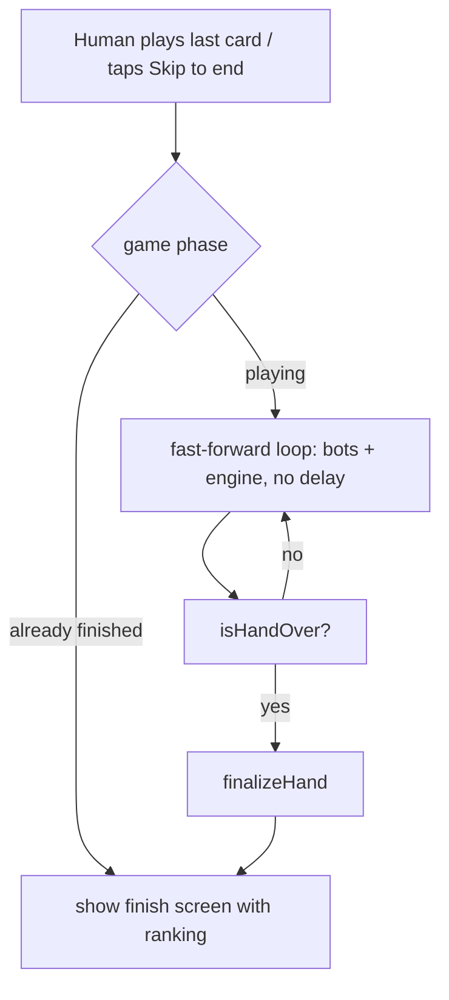
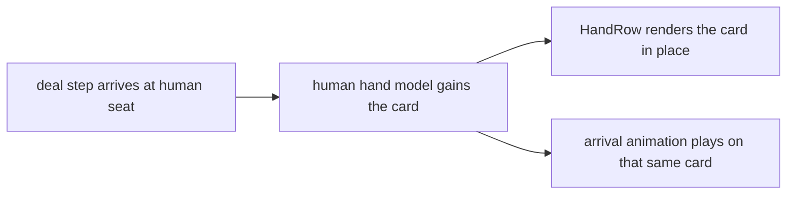

# feat: Table UX polish and felt-and-cards redesign (Phase A)

## Summary

Phase A of Round 2: fix the felt that doesn't scale, make the deal fill the player's hand live, highlight the player's hand on their turn, let bot games skip to the final ranking, and refine the existing green-felt-and-cards look into a cohesive design system with 5 new art assets. Client-side only; no backend. Online multiplayer, leaderboard, and Bluetooth are Phase B.

---

## Problem Frame

Round 1 shipped the redesign, social login, and the bot ladder. Playing it surfaced concrete table problems: the felt texture doesn't scale to the viewport, the dealing animation flies cards to seats but the player never sees their own hand build up, there's no signal that it's your turn, and after you win you have to watch the bots grind out the rest of the hand before seeing the ranking. The visual system is a good base but still reads slightly prototype-ish (spacing, hierarchy, seat plates). This phase makes the local game feel finished.

---

## Requirements

**Table UX**

- R1. The felt table background fills and scales cleanly at any viewport width, on web (mobile through desktop) and native, with no crop, tile seam, or pixelation.
- R2. During the deal, the player's own cards accumulate in their hand in real time and remain on screen when dealing ends (no separate empty-hand hand-off).
- R3. The player's hand area shows a clear active highlight when it is their turn, and loses it when it is not.
- R4. In bot games, once the human has emptied their hand, the game jumps to the final ranking by default instead of playing the bots out in real time.
- R5. A manual "Skip to end" control is available during a bot game so the player can end a hand early at any point.

**Redesign**

- R6. Home, sign-in, bot-select, and the game table share one refined design system (spacing scale, type hierarchy, seat plates, buttons, cards) built on the existing `lib/theme.ts` tokens.
- R7. Up to 5 new AI image assets are generated and integrated to elevate the table (candidates: refined felt/tile, seat frame, turn glow, iconography, empty/loading states). Further generations need explicit user approval.
- R8. The Bluetooth screen is a polished "coming soon" that explains the mode and does not look broken. No native Bluetooth is built this phase.
- R9. Shipped features keep working: playable-card highlighting, auto-pass, sort cycle, difficulty labels, social avatars.

---

## Key Technical Decisions

- **Felt as a resolution-independent surface, not a stretched photo**: fix R1 by making the table fill the root view and scale without distortion (tiling the texture or backing it with a theme-color gradient/vignette so any uncovered area still reads as felt), verified at multiple widths, rather than relying on a single fixed-size image under `resizeMode="cover"`.
- **The deal builds the real hand, not a throwaway animation layer**: reconcile the dealing animation with the actual hand model so dealt cards land in the player's hand component and stay, removing the current hand-off from an empty hand to a full one.
- **Skip-to-end fast-forwards the existing engine, it does not reimplement it**: R4/R5 run the current bot/engine loop to completion synchronously (no per-move delay) and then show the finish screen, so the ranking is identical to playing it out. Default auto-skip fires when the human finishes; the manual control uses the same path.
- **Design system stays token-driven and dependency-free**: R6 extends `lib/theme.ts` and `components/ui.tsx` (no UI-kit dependency), so the refresh is consistent and cheap to keep consistent.
- **Assets are static PNGs generated once, committed**: same pipeline as Round 1 (`scripts/gen_assets.py`, OpenAI gpt-image-2, key from Windows registry; gpt-image-2 rejects transparent backgrounds). Generation and approval happen in the orchestrating session, not a delegated worker.
- **Branch on top of the Round 1 redesign**: Phase A builds on `feat/redesign-login-bots` (PR #1, unmerged) so it includes the redesign, not `master`.
- **UI copy rules**: no em dashes, no emojis in user-facing strings.

---

## High-Level Technical Design

Skip-to-end control flow:

Deal-into-hand: the dealing animation and the hand render from the same seat-hand model, so a card that has "arrived" at the human seat is already a member of the rendered hand rather than a sprite that later disappears.

---

## Scope Boundaries

- **Phase B (next round):** online multiplayer, leaderboard wiring, and the backend architecture decision. Cloudflare direction to evaluate then: a Durable Object per game room for authoritative realtime state + WebSocket fan-out, D1 for the persistent leaderboard and profiles, and an auth decision (keep Supabase Auth vs. move to a Cloudflare-native path). D1 alone cannot push realtime updates, so it is not sufficient by itself.
- **Deferred to follow-up work:** real Bluetooth/BLE multiplayer (needs a native dev build and a native module; own track), sound design, animations beyond the deal/turn polish, per-difficulty stats.
- **Outside this phase:** monetization, tablet-specific layouts.

---

## Implementation Units

### U1. Felt fills and scales at any viewport

- **Goal:** The table felt covers the screen and scales cleanly on any width, fixing R1.
- **Requirements:** R1, R9
- **Dependencies:** none
- **Files:** `app/game-local.tsx` (TableBackground and `styles.tableBackground`), possibly `lib/theme.ts` (a felt gradient/vignette token), `assets/art/felt.png` (regenerate as a tileable texture only if U7 produces one).
- **Approach:** Make the felt surface fill the root (not just the safe-area inset) and scale without distortion. Prefer a tiling texture or a theme-color gradient/vignette base so any area the texture doesn't cover still reads as felt. Verify on web at mobile, tablet, and desktop widths and confirm no seam or crop.
- **Patterns to follow:** existing `TableBackground` wrapper; `useWindowDimensions` reactive-sizing pattern already used for the hand fan.
- **Test scenarios:** Test expectation: none (visual); manual: felt fills edge to edge at 375px, 768px, and 1280px web widths with no crop or pixelation; the safe-area insets still keep content clear of notches.
- **Verification:** screenshots at three widths show a full, undistorted felt.

### U2. Deal fills the player's hand live

- **Goal:** The player watches their own hand fill during the deal, and the cards stay when dealing ends (R2).
- **Requirements:** R2, R9
- **Dependencies:** none
- **Files:** `components/DealingAnimation.tsx`, `app/game-local.tsx`, possibly `lib/pusoy/localGame.ts` (expose a partial-hand-during-deal view if needed).
- **Approach:** Drive the human hand render from the same model the dealing sequence fills, so each card dealt to the human seat appears in the hand in deal order and persists into play. Keep opponents as face-down stacks. Remove the current visual discontinuity where the hand is empty during the animation and then appears fully populated.
- **Patterns to follow:** `HandRow`/`DraggableCard` fan layout; existing `dealOrder`/`DealStep` sequence in `lib/pusoy/localGame.ts`.
- **Test scenarios:**
  - The human hand grows from 0 to 13 as the deal proceeds and never resets to empty.
  - Cards land in deal order and remain after `startGame`.
  - Tap-to-skip still jumps straight to a full, playable hand.
  - Opponents remain face-down throughout.
- **Verification:** manual deal on web shows the hand building up card by card and staying.

### U3. Active turn highlight on the player's hand

- **Goal:** A clear highlight on the player's hand area when it is their turn (R3).
- **Requirements:** R3, R9
- **Dependencies:** U1 (theme tokens for the highlight), U5 preferred but not required
- **Files:** `app/game-local.tsx` (hand container / toolbar), `lib/theme.ts` (a highlight/glow token).
- **Approach:** When `isMyTurn`, apply a distinct but non-garish highlight to the hand area (e.g. a gold-accent border/glow consistent with the seat-plate active state), removed when it is not the human's turn. Must not fight the existing playable-card dimming or the selected-card lift.
- **Patterns to follow:** the existing `oppBoxActive` gold-accent active state on seat plates; `colors.gold` token.
- **Test scenarios:**
  - Highlight is present when `currentSeat === humanSeat` and absent otherwise.
  - Highlight coexists with dimmed unplayable cards and lifted selected cards without visual conflict.
  - During auto-pass (no legal play) the highlight still reads correctly for the brief human turn.
- **Verification:** manual game; highlight tracks the turn.

### U4. Skip to end and auto-jump to ranking

- **Goal:** Bot games end at the ranking once the human is out, plus a manual skip control (R4, R5).
- **Requirements:** R4, R5, R9
- **Dependencies:** none
- **Files:** `lib/pusoy/localGame.ts` (a fast-forward-to-finish function), `app/game-local.tsx` (auto-trigger + a "Skip to end" button), `lib/pusoy/localGame` tests.
- **Approach:** Add a function that runs the existing bot/engine loop to completion with no per-move delay and finalizes the hand, producing the same finish order as real-time play. Auto-invoke it when the human empties their hand (default behavior). Expose a "Skip to end" button during play that calls the same path. Cancel any pending bot timers when fast-forwarding.
- **Execution note:** test-first for the fast-forward function (it is pure game-loop logic).
- **Test scenarios:**
  - Fast-forward from a mid-hand state reaches `finished` with a complete finish order.
  - The finish order from fast-forward matches playing the same seeded game out move by move.
  - Auto-skip triggers exactly when the human's hand hits 0 and not before.
  - Pending bot timers are cleared so no stray move fires after finish.
  - Manual skip works before the human is out (ends the hand immediately, human ranked by remaining cards).
- **Verification:** `npm test` green; manual: winning a hand jumps to the ranking immediately.

### U5. Design system refresh

- **Goal:** One refined, cohesive look across home, sign-in, bot-select, and the table (R6).
- **Requirements:** R6, R9
- **Dependencies:** U1
- **Files:** `lib/theme.ts` (tighten spacing/type/elevation scales), `components/ui.tsx` (Button, Card, ScreenContainer), `components/PlayingCard.tsx`, `app/game-local.tsx` (seat plates, trick pile, toolbar), `app/index.tsx`, `app/sign-in.tsx`, `app/bot-select.tsx`.
- **Approach:** Apply strong visual-hierarchy and spacing discipline: consistent type scale, clearer primary/secondary/ghost button treatments, refined seat plates (avatar + name + count + state), a framed trick pile, and consistent card sizing/margins. Keep the classic green-felt casino identity; elevate, don't reinvent. No new dependencies.
- **Patterns to follow:** existing token module and `ui.tsx` primitives; the Round 1 screen structure.
- **Test scenarios:** Test expectation: none (styling); manual pass across all four screens at mobile and desktop widths; confirm R9 features still render correctly.
- **Verification:** before/after screenshots approved by the user.

### U6. Generate and integrate 5 new art assets

- **Goal:** Up to 5 new assets elevate the table and screens (R7).
- **Requirements:** R7
- **Dependencies:** U5 (palette/hierarchy inform the prompts)
- **Files:** `scripts/gen_assets.py` (new prompt entries), `assets/art/*.png` (up to 5 new), screen files that consume them.
- **Approach:** Generate candidates such as a tileable felt/inlay, a seat frame, a turn glow, suit/action iconography, and an empty/loading state. Style locked to the refined palette. Hard cap: 5 generations this round; regenerations wait for user approval. Generation and approval happen in the orchestrating session.
- **Test scenarios:** Test expectation: none (assets); manual visual check that each integrated asset loads (no broken image) and improves the screen.
- **Verification:** assets committed, visible in the running app, user has approved them.

### U7. Polish the Bluetooth "coming soon" screen

- **Goal:** The Bluetooth entry reads as an intentional upcoming feature, not a broken stub (R8).
- **Requirements:** R8
- **Dependencies:** U5
- **Files:** `app/bluetooth-info.tsx`, `app/index.tsx` (entry label/subtitle).
- **Approach:** Restyle the screen to the refined design system with a short explanation of the planned local-play mode and a clear "coming soon" state. No native Bluetooth code.
- **Test scenarios:** Test expectation: none (styling/copy); manual: screen renders on the new system and the home entry sets the right expectation.
- **Verification:** manual navigation.

---

## Execution Strategy

Executed by ce-work in a tmux session; units delegated by model tier. Image generation (U6) and approval stay in the orchestrating session because of the 5-generation approval gate. Build on `feat/redesign-login-bots`.

| Units | Model | Why |
|---|---|---|
| U3, U7 | haiku | Mechanical styling against a settled design |
| U1, U5 | sonnet | Visual judgment, moderate complexity |
| U2, U4 | opus | Deal/hand reconciliation and game-loop fast-forward correctness |

Suggested order: U1, then U5 (design system) so later units build on it, then U2, U3, U4 in parallel, then U6 assets, then U7. Commit per unit; `npm test` and `npm run typecheck` pass before every commit touching `lib/`.

---

## Risks & Dependencies

- **Deal-into-hand reconciliation (U2)** is the trickiest change: the animation and the real hand model must agree without regressing tap-to-skip or the fan layout. Mitigate by driving both from one model and testing the skip path.
- **Fast-forward determinism (U4):** the skipped result must match real-time play. Mitigate with a seeded test comparing both paths.
- **Image quality (U6):** 5-generation cap means a weak asset cannot be silently regenerated; the approval gate decides whether to spend more.
- **Preview-environment limits:** the hidden preview window freezes rAF (use tap-to-skip) and reports a 0x0 viewport, so layout/visual checks need screenshots from a visible browser or device.
- **Branch base:** Phase A depends on `feat/redesign-login-bots`; if PR #1 merges to master mid-flight, rebase.

---

## Sources & Research

- Existing code anchors: `app/game-local.tsx` (`TableBackground`, `styles.tableBackground` at ~line 643, `HandRow`, seat plates, `isMyTurn`), `components/DealingAnimation.tsx` (`dealOrder` fly-to-seat animation), `lib/pusoy/localGame.ts` (`createLocalGame`, `scheduleBots`, `finalizeHand`, `isHandOver`, bot timers), `lib/theme.ts` (`colors.felt`, `colors.gold`, spacing/type tokens), `components/ui.tsx` (Button/Card/ScreenContainer).
- Round 1 plan and identity: `docs/plans/2026-07-10-001-feat-redesign-login-bots-plan.md`.
- Phase B backend direction (Cloudflare): Durable Objects for realtime game rooms + D1 for leaderboard/profiles; D1 has no realtime push on its own. To be planned separately.
