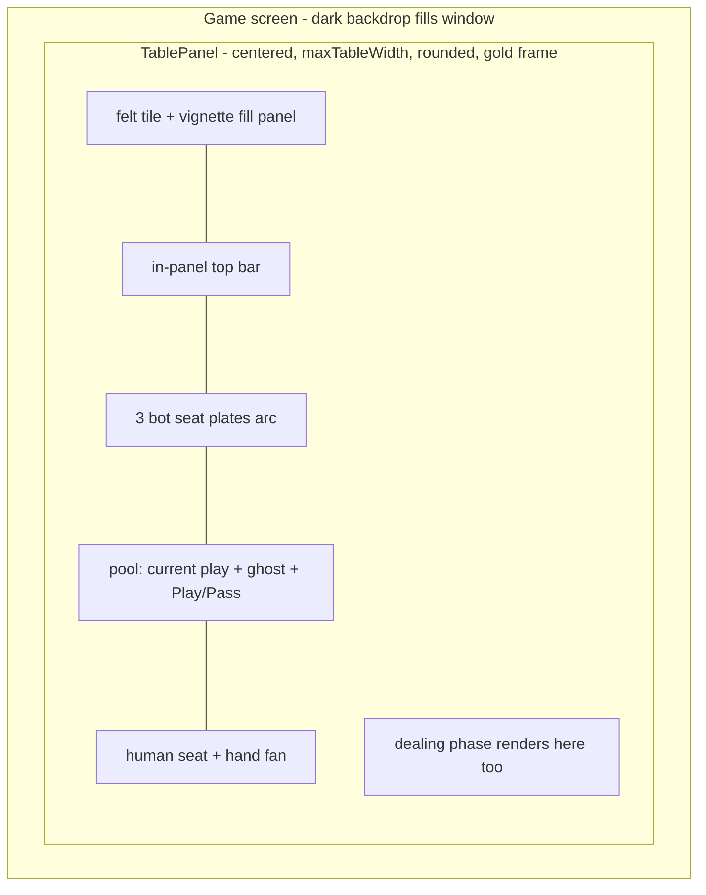
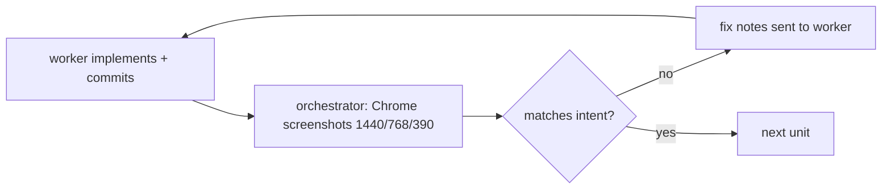

# feat: Bounded table panel and desktop polish

## Summary

Rebuild the game's visual composition around a bounded table panel — felt, frame, and content as one surface — so the game reads as a polished card game at any window size, fix the clipped hand fan, cap every menu screen to a centered column, and tighten card/button affordances. Every visual unit is verified against real Chrome screenshots (claude-in-chrome), not DOM assertions; a real-browser baseline of the current defects was captured before planning.

---

## Problem Frame

Real-browser screenshots show the game falling apart on desktop Chrome: the decorative inlay renders as a giant oval detached from the content, the felt tile seams mid-screen, the content column floats in an oversized canvas, hand cards clip at the bottom (container height uses the card width constant, not height), and menu screens stretch full-width. The root cause is architectural: decoration is full-bleed while content is capped, so they can never compose. The fix is a bounded table panel where surface and content share one box.

---

## Requirements

- R1. The hand fan renders fully, no card clipped, at desktop and mobile widths.
- R2. The game renders as one bounded table panel: felt texture, frame, vignette, and all play content live inside a centered, rounded, capped panel on a dark backdrop; no seam, no detached decoration, at 1440px, 768px, and ~390px widths.
- R3. The dealing phase renders inside the same panel (same fan positions, same seats), not as a full-window overlay.
- R4. Every menu screen (home, sign-in, bot-select, stats, leaderboard, bluetooth) lays out as a centered max-width column on desktop; no full-width stretched buttons.
- R5. Card affordances read clearly: dimmed cards legible but obviously inactive, selected cards get a gold edge plus lift, cards carry a subtle shadow.
- R6. Buttons are consistent: equal heights, clear primary (Play) / danger (Pass) / secondary treatments, sensible disabled states; no button label ever wraps ("Skip to end" renders on one line).
- R9. Seats use the space: with only 4 players, seat plates and avatars are substantially larger (avatar on the order of 48px+, plate proportions to match) so the opponents read as characters, not chips.
- R7. Every visual change is accepted only after a real Chrome screenshot at the three reference widths matches the intent; the final result is screenshot-approved by the user.
- R8. Shipped behavior unchanged: engine tests stay green; highlighting, auto-pass, sort, skip, drag-to-play, scoreboard all still work.

---

## Key Technical Decisions

- **Bounded table panel over full-bleed felt** (user-confirmed): a `TablePanel` owns the surface — felt tile, frame border, vignette, rounded corners, shadow — and all game content renders inside it. Decoration and content share one box, so they compose at every window size by construction.
- **Panel replaces the bare 560px column**: `layout.maxTableWidth` stays the cap, but the capped element is now the visible table, not an invisible column on full-bleed art. The backdrop outside the panel is a flat dark green-ink tone.
- **Drop the generated inlay art from the game screen; frame with code**: the inlay PNG's fixed aspect can never hug a resizable panel (today's detached-oval defect). The panel frame becomes a code-drawn double gold border (crisp at any size); the inlay art stays available for fixed-aspect surfaces like the splash.
- **Dealing becomes an in-panel phase, not a window overlay**: `DealingAnimation` renders inside the panel and derives all positions from the panel box, killing the corner-flung seat names and stray card.
- **Real-screenshot QC gate**: implementation happens in the tmux worker (opus/sonnet/haiku for tasks and code review); visual acceptance happens in the orchestrating session via claude-in-chrome screenshots at 1440/768/390, because the worker CLI has no browser and the hidden preview cannot paint. A "QC baseline" screenshot set was captured pre-plan for comparison.
- **Menu screens get one shared centered-column primitive**: extend `ScreenContainer` with a default max content width instead of per-screen wrappers.
- **UI copy rules**: no em dashes, no emojis in user-facing strings.

---

## High-Level Technical Design

Component shape of the game screen after the change:

QC loop per visual unit:

---

## Scope Boundaries

- **Deferred to follow-up work:** win-screen celebration art (1 banked image credit reserved; only if time allows after R1-R7), sounds, animations beyond existing, per-difficulty stats surfacing.
- **Out of scope:** online play, new gameplay features, native builds.

---

## Implementation Units

### U1. Fix the clipped hand fan

- **Goal:** No card is ever cut off at the bottom (R1).
- **Requirements:** R1
- **Dependencies:** none
- **Files:** `app/game-local.tsx` (HandRow container height), `components/DealingAnimation.tsx` (deal fan bottom offset).
- **Approach:** The fan container's height derives from the card height constant plus lift headroom (it currently uses the card width constant); the deal fan's bottom offset gets the same audit so dealt cards land unclipped.
- **Test scenarios:** Test expectation: none (layout); screenshot QC: bottom edge of every card visible at 1440 and 390 widths, including a selected (lifted) card.
- **Verification:** Chrome screenshots show the full fan with breathing room.

### U2. TablePanel: bounded table surface

- **Goal:** One composed table at any window size (R2), with seats sized for a 4-player table (R9).
- **Requirements:** R2, R8, R9
- **Dependencies:** U1
- **Files:** `app/game-local.tsx` (replace `TableBackground` + `tableColumn` with `TablePanel`), `lib/theme.ts` (backdrop color token, panel frame tokens).
- **Approach:** Dark backdrop view fills the window; inside it a centered panel (width capped at `layout.maxTableWidth`, full height minus margin, rounded corners, code-drawn double gold border, soft shadow) clips its children. The felt tile (`repeat`) and the vignette render inside the panel; the table-inlay Image is removed from this screen. Top bar, seats, pool, and hand all render inside the panel. On narrow/mobile widths the panel margin collapses so it is effectively full-screen. Seat plates scale up per R9: framed avatars around 48px+, larger name/count type, the plate arc filling the panel width.
- **Patterns to follow:** existing `styles.tableColumn` cap and felt/vignette layers, relocated inside the panel.
- **Test scenarios:** engine/UI tests stay green (`npm test`); screenshot QC at 1440/768/390: no tile seam, frame hugs the panel, no decoration outside the panel, panel centered.
- **Verification:** three-width screenshot set approved.

### U3. Dealing renders in the panel

- **Goal:** The deal looks like it happens on the same table (R3).
- **Requirements:** R3, R8
- **Dependencies:** U2
- **Files:** `components/DealingAnimation.tsx`, `app/game-local.tsx`.
- **Approach:** The dealing phase renders as panel content (same seats row, same fan geometry) instead of an absolute full-window overlay; fly-to-seat targets derive from the panel box, not window fractions. Tap-to-skip still covers the whole panel.
- **Test scenarios:** screenshot QC mid-deal: seat names sit where the seat plates sit in play, dealt cards land exactly where the live hand renders (capture mid-deal and post-deal, positions match); tap-to-skip still works.
- **Verification:** mid-deal and post-deal screenshots align.

### U4. Centered menu columns

- **Goal:** Menus read as designed pages, not stretched lists (R4).
- **Requirements:** R4
- **Dependencies:** none (parallel with U2)
- **Files:** `components/ui.tsx` (ScreenContainer max content width), `app/index.tsx`, `app/sign-in.tsx`, `app/bot-select.tsx`, `app/stats.tsx`, `app/leaderboard.tsx`, `app/bluetooth-info.tsx`, `app/settings.tsx`.
- **Approach:** `ScreenContainer` centers its children in a max-width column (reusing home's existing 480px content cap as the shared default); screens drop any ad-hoc width handling. Buttons stop stretching past the column.
- **Test scenarios:** Test expectation: none (styling); screenshot QC: each menu at 1440 shows a centered column with the cream background full-bleed; at 390 nothing changed visually.
- **Verification:** desktop screenshots of all six menus approved.

### U5. Card and button affordances

- **Goal:** Cards and actions read at a glance (R5, R6).
- **Requirements:** R5, R6, R8
- **Dependencies:** U2
- **Files:** `components/PlayingCard.tsx` (dimmed/selected/shadow treatments), `app/game-local.tsx` (button row consistency).
- **Approach:** Dimmed cards keep face legibility (tinted overlay or reduced-contrast treatment instead of heavy transparency over dark felt); selected cards add a gold border with the existing lift; all cards get a slightly stronger, consistent shadow. Play/Pass/Sort buttons share height and radius; Play reads as the primary when enabled; disabled states dim uniformly.
- **Test scenarios:** screenshot QC: a hand with mixed dimmed/selected/normal cards is readable and states are unambiguous; Play disabled vs enabled visibly distinct; drag-to-play and tap selection still work (manual in Chrome).
- **Verification:** screenshot approved; interactions exercised live in Chrome.

### U6. Full-flow screenshot QC and sign-off

- **Goal:** The whole game holds together end to end (R7).
- **Requirements:** R7, R8
- **Dependencies:** U1-U5
- **Files:** none (verification unit).
- **Approach:** In Chrome: home → bot-select → deal (mid-deal capture) → play several turns (select, drag-to-play, pass, auto-pass) → skip → finish screen → scoreboard, capturing at 1440 and 390. Compare against the pre-plan baseline set; run `npm test` and `npm run typecheck`; present the final set to the user for approval.
- **Test scenarios:** the full capture list above, plus: no render-loop console errors during the session; all art loads (no broken images).
- **Verification:** user approves the final screenshot set.

---

## Execution Strategy

Implementation runs in a tmux ce-work worker; visual acceptance runs in the orchestrating session because only it can drive the user's Chrome. Per-unit loop: worker commits, orchestrator screenshots at 1440/768/390, pass/fail with concrete fix notes.

| Units | Model | Why |
|---|---|---|
| U4 | haiku | Mechanical container change across screens |
| U1, U5 | sonnet | Contained layout/styling with visual judgment |
| U2, U3 | opus | Structural rework of the table surface and deal phase |
| Code QC | worker's review phase (opus + sonnet reviewers) | correctness, regressions |
| Visual QC | orchestrator + claude-in-chrome | real pixels, three widths |

Order: U1 first (one-line class of fix, immediate user-visible win), then U2, U3; U4 in parallel; U5, then U6 sign-off. Commit per unit; `npm test` + `npm run typecheck` before every commit.

---

## Risks & Dependencies

- **Chrome QC loop depends on the extension staying connected** and the dev server on port 8095; if Chrome disconnects mid-run, visual QC pauses rather than falling back to DOM-only assertions (that fallback is what shipped the current defects).
- **Removing the inlay art changes the look**: the code-drawn frame must carry the "classic table" feel; the U2 screenshot gate judges this explicitly before U3+ proceed.
- **DealingAnimation rework touches the tap-to-skip path** used everywhere in testing; U3's QC includes exercising it.
- **Oversized-canvas symptom**: the baseline screenshot shows white bands outside the app root; if U2 doesn't eliminate it, root-cause it there (document/root sizing on web) rather than shipping around it.

---

## Sources & Research

- Real-browser baseline screenshots (claude-in-chrome, 2026-07-11): dealing screen with corner-flung names; in-game table with detached oval inlay, tile seam, offset column, clipped hand. These are the acceptance baseline.
- Code anchors: `app/game-local.tsx` (`TableBackground`, `tableColumn`, `HandRow` fan height, seat plates, pool), `components/DealingAnimation.tsx` (window-fraction seat targets), `components/ui.tsx` (`ScreenContainer`), `components/PlayingCard.tsx` (dimmed/selected), `lib/theme.ts` (`layout.maxTableWidth`).
- Prior plans: `docs/plans/2026-07-10-002-feat-table-ux-and-redesign-plan.md` (Phase A), `docs/plans/2026-07-10-001-feat-redesign-login-bots-plan.md` (Round 1).
