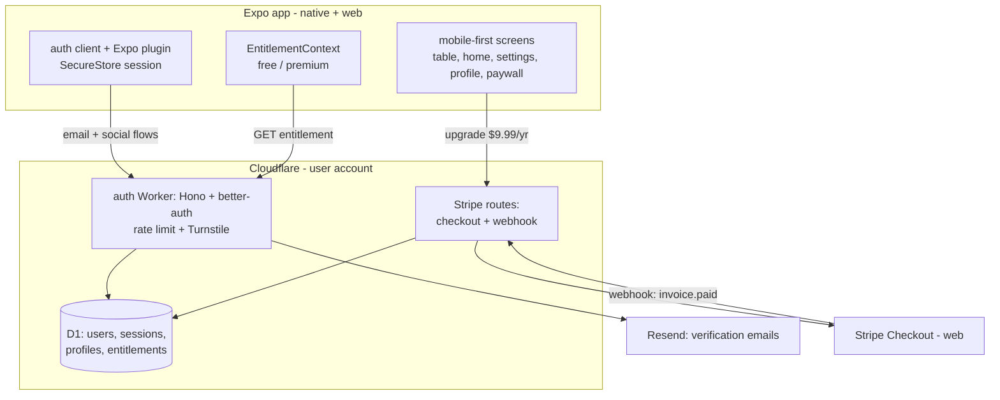
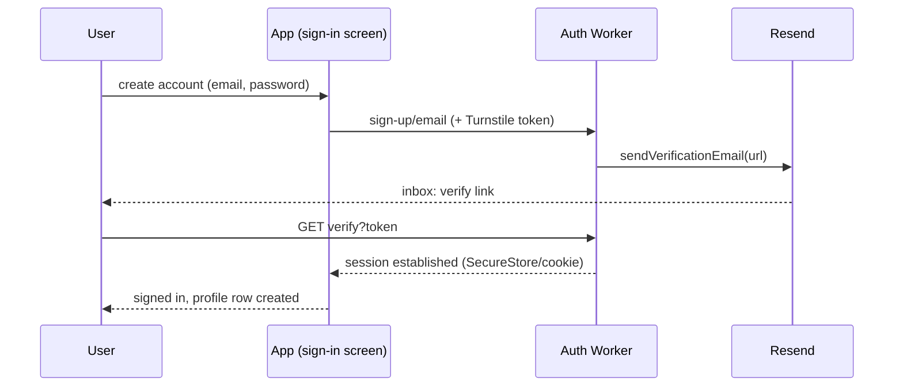

# feat: Mobile-first UI, Cloudflare auth, and monetization plumbing

## Summary

Three tracks: rebuild the app's surfaces mobile-first using researched card-game UI patterns; migrate accounts to a Cloudflare-native stack (better-auth on a Worker + D1) adding email/password accounts with verification, replacing Supabase entirely; and lay the monetization plumbing — entitlements, a $9.99/year no-ads offer via Stripe (web), placeholder ad slots, and a 20-game counter built but not enforced. wrangler is already authenticated on the machine, so the Worker and D1 deploy and get live-tested this round; email accounts are fully testable end to end without any third-party app registrations.

---

## Problem Frame

The game plays well but the product shell is thin: no email accounts (social-only, and its Supabase backend was never provisioned), no settings/profile surfaces, no revenue path, and the UI was composed for desktop QC rather than the phones it will actually be played on. The user chose to consolidate the whole backend on Cloudflare (one platform, already paid for, same D1/Workers stack the future online mode needs), which makes Supabase dead weight to remove rather than provision.

---

## Requirements

**Auth (Cloudflare)**

- R1. An auth Worker (better-auth on Hono, D1 database) is deployed to the user's Cloudflare account, with secrets in wrangler secrets, rate limiting on, and Turnstile captcha protecting sign-up, sign-in, and password reset.
- R2. Users can create an account with email + password, receive a verification email, verify, sign in, reset password, and sign out — live-tested end to end this round.
- R3. Google and Facebook sign-in are configured via better-auth social providers and work as soon as the user registers the OAuth apps (registration is a documented manual prerequisite; not blocking email accounts).
- R4. The app's auth client (Expo plugin, SecureStore session storage, `pusoynow` scheme in trustedOrigins) replaces every Supabase call; the Supabase dependency and dead code are removed; social avatars still work post-migration.
- R5. Security verified, not assumed: no secret appears in the client bundle; rate limiting observably fires; unverified emails cannot sign in; session expiry/refresh configured; `trustedOrigins` locked to the web origin + app scheme.

**Monetization plumbing**

- R6. An entitlement model exists end to end: D1 table + Worker endpoints + client context distinguishing free vs premium ($9.99/year no-ads).
- R7. Stripe Checkout (subscription mode, official Workers pattern) creates the $9.99/year purchase on web, with a webhook flipping the D1 entitlement; native app-store IAP is explicitly deferred. Works in Stripe test mode this round; the live price ID is a user prerequisite.
- R8. Ad SLOTS exist with house-ad placeholders (bottom-anchored adaptive banner outside the play area; interstitial hook at hand-end) — no ad SDK this round; premium hides the slots.
- R9. A per-mode game counter records completed games with a config `{ freeGameLimit: 20, enforced: false }`; the paywall sheet exists and is reachable from Settings, but nothing gates play until the flag flips.

**Mobile-first UI**

- R10. The game table follows the researched portrait patterns: shallow-arc hand fan (~65-75% overlap, edge cards angled), avatar turn-ring on the active seat, card-count badge on plates, primary action in the bottom-right thumb zone, small persistent top chips.
- R11. Home gets one dominant Play CTA with a compact icon nav (Play / Scoreboard / Settings); Settings becomes a real grouped-row screen (Sound, Haptics, Account, Remove Ads, Privacy/Terms, version footer); a Profile screen shows avatar, name, guest-vs-linked state, and the stats row.
- R12. Every changed surface is verified on a phone-sized viewport (~390px) via real Chrome screenshots before acceptance; desktop keeps the bounded table panel.
- R13. Shipped behavior keeps working: bots, difficulty, scoreboard, skip, drag-to-play, deal-into-hand; engine tests stay green.

---

## Key Technical Decisions

- **better-auth over OpenAuth/Clerk/hand-rolled** (research-backed): first-class D1 support (direct `env.DB` binding, `batch()` atomicity), a maintained Expo plugin, built-in rate limiting and a Turnstile captcha plugin — all inside the Workers/D1 stack. OpenAuth is a lower-level issuer; Clerk is hosted/paid and off-platform.
- **Auth config instantiated per request** on the Worker (D1 binding arrives via `env`, not module scope) — the documented Hono + Cloudflare pattern.
- **Client and server auth code stay in separate packages**: the Worker lives in `server/` with its own package.json so `@better-auth/expo` never drags Expo peer deps into the Worker build (known issue) and the Worker never enters the Metro bundle.
- **Verification email: Resend free tier first** (3,000/month, 100/day — plenty for now), sent from better-auth's `sendVerificationEmail` hook. Cloudflare's own Email Sending was considered (the account has the scope) but Resend's DX is proven with better-auth today; swapping later is a one-hook change.
- **Sessions via the Expo plugin's SecureStore cookie-jar** on native and standard cookies on web; no custom bearer scheme. react-native-web is undocumented territory for the plugin, so web flows get explicit manual testing (our QC is web-first anyway).
- **Stripe only on web this round** (official `stripe-node` Workers template: checkout session create + signature-verified webhook). App-store builds must use IAP — deferred with the native-build milestone, and the paywall copy on native says "purchase on the website".
- **Entitlement lives in D1, cached in the client context**; guests' game counters stay local (same storage pattern as the scoreboard) and merge into D1 on sign-in later (deferred).
- **Cap plumbing, not enforcement**: counter + paywall ship dark behind `{ enforced: false }` per the user's decision; flipping one config value turns the gate on.
- **UI patterns come from the reference research** (UNO/Callbreak/Big Two apps, Game UI Database, Mobbin): arc fan, turn-rings, thumb-zone actions, grouped settings rows, bottom-anchored banner outside the play area, "Remove Ads" row in Settings plus soft post-game prompt.
- **UI copy rules**: no em dashes, no emojis in user-facing strings.

---

## High-Level Technical Design

Email account flow (live-testable this round with zero external registrations beyond a Resend key):

---

## Scope Boundaries

- **Deferred to follow-up work:** native ad SDK (AdMob) + EAS dev build, app-store IAP, TikTok login on the Worker, guest-counter merge on sign-in, enforcement flip of the 20-game cap, Apple sign-in (store submission time).
- **Out of scope this round:** online multiplayer (Phase B: Durable Objects + same D1), leaderboard backend, Bluetooth.

---

## Implementation Units

### U1. Auth Worker scaffold on Cloudflare

- **Goal:** A deployed, healthy better-auth Worker with D1 (R1).
- **Requirements:** R1
- **Dependencies:** none
- **Files:** `server/package.json`, `server/wrangler.toml`, `server/src/index.ts` (Hono + better-auth mounted at `/api/auth/*`), `server/src/auth.ts` (per-request auth factory), `server/migrations/` (better-auth schema for D1), `server/src/index.test.ts`, root `README.md` (setup section).
- **Approach:** Separate package (never in Metro). `wrangler d1 create pusoy-now` + migrations via better-auth CLI schema generation; secrets (`BETTER_AUTH_SECRET`, later provider keys) via `wrangler secret put`; `trustedOrigins`: web origin(s) + `pusoynow://`; rate limit `storage: "database"` enabled in production; deploy with wrangler (already authenticated) and verify `/api/auth/ok`-style health.
- **Test scenarios:** health endpoint 200 in local `wrangler dev` and deployed; D1 tables exist post-migration; a request with a forged origin is rejected (trustedOrigins); rate limit returns 429 after exceeding the window in dev-forced config.
- **Verification:** deployed URL responds; `wrangler d1 execute` shows schema.

### U2. Email accounts end to end

- **Goal:** Sign-up, verify, sign-in, reset, sign-out working live (R2, R5 parts).
- **Requirements:** R2, R5
- **Dependencies:** U1
- **Files:** `server/src/auth.ts` (emailAndPassword + emailVerification + captcha plugin), `server/src/email.ts` (Resend sender), `server/src/auth.test.ts`.
- **Approach:** `requireEmailVerification: true`; verification + reset emails through Resend from the hook; Turnstile captcha plugin on sign-up/sign-in/reset endpoints (managed widget client-side); passwords never logged. Resend API key is a user-supplied secret; until provided, a dev mailbox mode (log the verify URL) keeps tests running.
- **Execution note:** test-first against `wrangler dev` with the dev mailbox.
- **Test scenarios:** sign-up creates unverified user, sign-in before verify fails with the right error; verify link flips the flag and sign-in succeeds; wrong password fails without user enumeration (same error shape); reset flow issues single-use token; captcha-missing requests rejected; rate limit fires on repeated sign-in attempts.
- **Verification:** a real account created and verified against the deployed Worker (real inbox once Resend key exists; dev-mode URL otherwise).

### U3. Social providers on the Worker

- **Goal:** Google + Facebook configured; TikTok explicitly deferred (R3).
- **Requirements:** R3
- **Dependencies:** U1
- **Files:** `server/src/auth.ts` (socialProviders), `docs/AUTH-SETUP.md` (exact console steps + redirect URIs `{workerURL}/api/auth/callback/google|facebook`), `.env.example` cleanup.
- **Approach:** Providers read client id/secret from wrangler secrets; avatar + name mapped into the profile row on first sign-in (ports the Round-1 avatar sizing helpers). Blocked-on-user-credentials paths are feature-detected: buttons show "not configured" state until secrets exist.
- **Test scenarios:** with dummy secrets, the authorize redirect URL is well-formed per provider; missing-secret state degrades to disabled buttons (no crash); profile mapping unit-tested with fixture provider payloads.
- **Verification:** authorize URLs verified; live test deferred until the user registers the OAuth apps (documented).

### U4. Client auth migration off Supabase

- **Goal:** The app speaks better-auth everywhere; Supabase is gone (R4).
- **Requirements:** R4, R13
- **Dependencies:** U1, U2
- **Files:** `lib/auth.tsx` (rewrite on `better-auth/react` + `@better-auth/expo/client`), `lib/authClient.ts` (new), `app/sign-in.tsx` (email create-account/sign-in/reset forms + provider buttons + verification-pending state), `app/_layout.tsx`, `lib/profile.ts` (now calls the Worker API), delete `lib/supabase/`, `supabase/` folder retirement note, `package.json` (drop @supabase/supabase-js, add better-auth + @better-auth/expo), `lib/auth.test.ts`.
- **Approach:** Keep the AuthContext surface (`session`, `profile`, `signIn`, `signOut`) so game/table code is untouched; add `signUpEmail`, `signInEmail`, `resetPassword`. SecureStore storage on native, cookie flow on web; guest mode unchanged.
- **Test scenarios:** context state transitions (guest → pending-verification → signed-in → signed-out) with a mocked client; form validation (bad email, short password, mismatch) before any network call; cancelled social flow stays guest; avatar fallback to initials when no picture.
- **Verification:** live email sign-up from the running app against the deployed Worker; `grep` proves no supabase import remains; engine tests green.

### U5. Entitlements, Stripe, counters, paywall

- **Goal:** The money plumbing, dark-launched (R6-R9).
- **Requirements:** R6, R7, R8, R9
- **Dependencies:** U1, U4
- **Files:** `server/src/entitlements.ts` (D1 table + GET/webhook routes), `server/src/stripe.ts` (checkout session + signature-verified webhook), `server/migrations/` (entitlements), `lib/entitlements.tsx` (client context + config `{ freeGameLimit: 20, enforced: false }`), `lib/gameCounter.ts` (local storage, same pattern as lib/stats.ts), `app/paywall.tsx` (sheet: $9.99/year, benefits list, Stripe checkout on web, "purchase on the website" note on native), `components/AdBanner.tsx` (house-ad placeholder, bottom-anchored, hidden for premium), `app/game-local.tsx` (banner slot outside the play area + hand-end interstitial hook stub + counter increment on finish), `server/src/entitlements.test.ts`, `lib/entitlements.test.ts`.
- **Approach:** Stripe official Workers pattern; entitlement = `premium_until` timestamp; client caches entitlement on auth load; counter increments only on legitimately finished games (reuse the scoreboard's no-count-on-bailout rule); nothing blocks play while `enforced` is false.
- **Test scenarios:** webhook with bad signature rejected; `checkout.session.completed` flips entitlement exactly once (idempotent on retry); GET entitlement requires session; premium hides AdBanner; counter increments on finish, not on manual skip; paywall renders on both platforms with the right purchase affordance; config flip to `enforced: true` blocks game 21 in a unit test (flag returned to false).
- **Verification:** Stripe test-mode checkout completes and flips D1; banner shows for free, hidden for premium.

### U6. Mobile-first table

- **Goal:** The in-game screen reads like the referenced mobile card games on a phone (R10, R13).
- **Requirements:** R10, R12, R13
- **Dependencies:** none (parallel); banner slot from U5 lands here when both merge
- **Files:** `app/game-local.tsx`, `components/PlayingCard.tsx`, `components/Avatar.tsx` (turn-ring w/ subtle pulse), `components/DealingAnimation.tsx` (fan parity).
- **Approach:** Arc the fan (translateY per index on a shallow curve, ~65-75% overlap, slight rotation on edge cards); turn-ring glow on the active avatar replacing part of the plate-glow; count badge chip on plates; Play button anchored bottom-right thumb zone with Pass beside it (kept red); Sort/Skip stay top; persistent compact chips top-center. Portrait-first; the desktop bounded panel keeps working.
- **Test scenarios:** engine/UI tests green; screenshot QC at 390px and 1440px: full fan visible, arc reads, turn-ring on the correct seat, buttons thumb-reachable, banner slot (from U5) never overlaps the fan.
- **Verification:** phone-viewport Chrome screenshots accepted.

### U7. Menus: home, settings, profile

- **Goal:** Real product surfaces per the reference patterns (R11).
- **Requirements:** R11, R12
- **Dependencies:** U4 (account state), U5 (Remove Ads row → paywall)
- **Files:** `app/index.tsx` (dominant Play CTA + icon nav), `app/settings.tsx` (grouped rows: Sound + Haptics toggles persisted via lib/settings.ts (new), Account row → profile, Remove Ads row → paywall, Privacy/Terms links, version footer), `app/profile.tsx` (new: avatar, name, guest-vs-linked CTA, stats row reusing lib/stats.ts), `app/_layout.tsx` (routes/titles).
- **Approach:** Keep the cream identity; rows are the standard toggle/chevron pattern; sound/haptics are stored settings consumed later (no audio engine this round — the toggle persists only).
- **Test scenarios:** settings persist across reload; profile shows guest CTA when signed out and account + stats when signed in; every row navigates; screenshot QC at 390px for all three screens.
- **Verification:** phone-viewport screenshots accepted; navigation exercised live.

### U8. Live security and flow verification

- **Goal:** Prove R5 and the whole round end to end (R2, R5, R12).
- **Requirements:** R2, R5, R12, R13
- **Dependencies:** U1-U7
- **Files:** `docs/SECURITY-CHECK.md` (results log).
- **Approach:** Orchestrator-led: create/verify/sign-in/sign-out a real account from the app; attempt the abuse cases (unverified sign-in, wrong password enumeration shape, rate-limit burst via script, forged origin, webhook with bad signature); inspect the exported web bundle for any secret string; full-flow phone-viewport screenshot set; `npm test` + typecheck.
- **Test scenarios:** the checklist above, each with observed result recorded in the doc.
- **Verification:** SECURITY-CHECK.md filled with pass results; screenshot set approved by the user.

---

## Execution Strategy

ce-work in tmux on a separate socket (default tmux server wedges); implementation and code review in the worker, image generation + live-browser QC + deploys/live security tests in the orchestrating session (only it holds wrangler auth interactivity and the user's Chrome).

| Units | Model | Why |
|---|---|---|
| U7 | haiku | Settled row/nav patterns |
| U5 (client parts), U6 | sonnet | Visual judgment + contained logic |
| U1, U2, U3, U4, U5 (server parts) | opus | Auth/security/payments correctness |
| Code QC | worker review phase | regressions |
| Visual + live QC | orchestrator (Chrome + wrangler) | real pixels, real deploys |

Order: U1 → U2 (server first, live email accounts are the round's proof), U4, then U5; U6/U7 parallel on sonnet/haiku; U8 last. Commit per unit; engine tests + typecheck before every commit.

Image budget (10): 1 house-ad banner placeholder, 1 premium/crown badge for the paywall, 1 paywall hero; ~7 banked pending need.

---

## Risks & Dependencies

- **User prerequisites (documented, not blocking email accounts):** Resend API key (verification emails; dev-mode logs the link until then), Google Cloud + Meta OAuth registrations (social), Stripe account + yearly price ID (live payments; test mode works now), Turnstile site key (free, 2 minutes in the dashboard).
- **@better-auth/expo rough edges** (research): known Android bundling and social null-session issues, RNW undocumented — mitigated by separate server package, web-first testing, and pinning the current stable (1.6.x); native device testing is a later milestone.
- **Supabase removal touches Round-1 auth code** — the AuthContext surface is preserved so the table/avatar code doesn't churn; TikTok Worker port deferred rather than half-migrated.
- **Stripe webhook idempotency** and signature verification are explicit test scenarios, not assumptions.
- **Scope size:** this is the largest round yet; U1-U2 land value even if later units slip.

---

## Sources & Research

- UI reference report (2026-07-11): UNO Mobile / Callbreak / B-Bro Big2 / Balatro patterns, Game UI Database (screens 2/23/26), Mobbin card+game galleries, AdMob interstitial guidance, remove-ads pricing comps ($2.99-4.99 one-time; ~$21/yr subs; $9.99/mo VIP) — grounds R10-R12, ad placement, and the $9.99/yr price position.
- better-auth research (2026-07-11): v1.6.23; D1 direct binding + `batch()`; Hono per-request pattern (hono.dev/examples/better-auth-on-cloudflare); Expo plugin docs + issues #4471/#7603/#3711; Resend limits (3k/mo, 100/day); MailChannels free tier EOL; captcha plugin w/ Turnstile; rate-limit docs; Stripe Workers template (stripe-samples/stripe-node-cloudflare-worker-template).
- Local anchors: `lib/auth.tsx`, `lib/profile.ts`, `lib/stats.ts` (storage pattern), `app/sign-in.tsx`, `app/settings.tsx`, `app/game-local.tsx` (banner slot + finish hook), prior plans in `docs/plans/`.
- wrangler authenticated as the user's account (verified this session) — deploys and D1 creation are available now.
