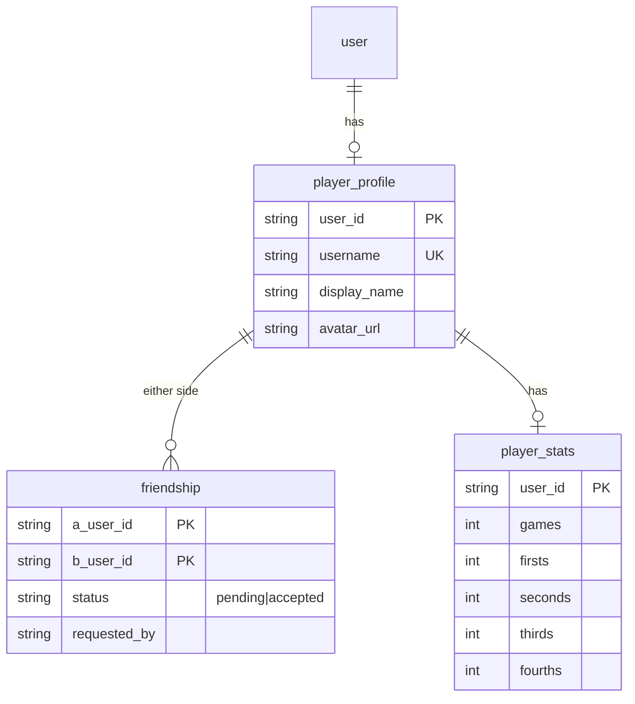
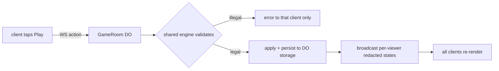

# feat: Clean UI, friends, and invite-link online play

## Summary

Three connected tracks. Restyle every non-game screen to the clean reference language the user provided (cream, soft borderless cards, pill buttons with disabled/loading states, minimal chevron headers, inline validation, big stat numerals) with felt green as the accent. Add the social layer: unique usernames, friends (add by username, requests, remove), and a friends ranking (total wins, win-rate tiebreak) backed by stats sync to D1. Ship real online play: a host creates a room, shares a link, friends join (auto-friending everyone), and 2-4 players play live on a Durable Object running the existing engine server-side, with bots filling empty seats. The web app deploys to Cloudflare Pages so invite links are real URLs.

---

## Problem Frame

The game is single-device versus bots. The user wants the app to feel like the pasted reference designs (very clean, calm, product-grade) and, more importantly, wants groups of friends to actually play together with zero-friction joining — share a link, land at the table, be friends automatically. Accounts, D1, and the auth Worker from Round 4 make all of this buildable; the deferred online-play decision (Durable Objects + D1, chosen earlier) now gets executed.

---

## Requirements

**Design language (reference sheets in chat)**

- R1. A v2 design system: full-width pill buttons (felt-green primary, white secondary, pale disabled, loading-dots state), borderless rounded cards with faint shadows, minimal header (back chevron, centered title, optional right text action), input fields with inline soft-red validation banners, big-numeral stat display. No mascot images; card motifs where natural.
- R2. Home, sign-in, settings, profile, scoreboard, paywall, bluetooth, and the new social screens all sit on the v2 system; the game table keeps its felt-and-cards look with only button shapes aligned.
- R3. Every restyled screen passes phone-width screenshot QC in a real browser.

**Social**

- R4. Every account has a unique username (3-20 chars, lowercase letters/digits/underscore), claimed on first visit to Profile after this ships; display name stays separate.
- R5. Friends: send a request by username, accept/decline, remove; pending (incoming/outgoing) and accepted lists; all endpoints session-gated on the existing Worker with rate limiting.
- R6. Stats sync: signed-in users' completed games (bots or online, not bail-outs) upsert cumulative totals to D1; guests stay local-only.
- R7. Friends ranking: you plus accepted friends ranked by total 1st-place finishes, win-rate tiebreak; your row highlighted.

**Online play**

- R8. A signed-in user creates a room (2, 3, or 4 seats), gets a share link (public web URL + app deep link); anyone signed-in who opens it joins a free seat.
- R9. Everyone who joins a room is automatically made friends with everyone else in it (idempotent; no requests needed).
- R10. The host starts the game once at least 2 humans are seated; unfilled seats are taken by bots at the host's chosen difficulty.
- R11. Gameplay is server-authoritative on a Durable Object running the shared engine: clients send play/pass actions over WebSockets, the DO validates and broadcasts; each client receives only its own hand (opponents' cards redacted to counts).
- R12. Online turns carry a 30-second timer; timeout auto-passes (engine's existing timeout path). Disconnected players can reconnect and resume their seat; a fully abandoned room expires.
- R13. The engine supports 2-4 players: 13 cards each, leftover cards unused, leader is the 3-of-clubs holder or, absent that card, the lowest-card holder; a hand ends when all but one player is out.
- R14. Finished online games record to the same stats/ranking as bot games.
- R15. The web app is deployed to Cloudflare Pages at a stable public URL; invite links use it; the auth Worker trusts it (trustedOrigins + CORS).

**Integrity**

- R16. Existing features keep working (bots, difficulty, scoreboard, auth, entitlements); engine tests stay green; online-specific security is verified live (WS rejects unauthenticated connects, out-of-turn and out-of-seat actions rejected, hand redaction confirmed from a second client, friends endpoints reject IDOR).

---

## Key Technical Decisions

- **The engine runs on the Durable Object, not the client**: `lib/pusoy/` is pure TypeScript with an injectable rng, so the server imports the same engine the bot mode uses — one rules implementation, no drift, server-authoritative by construction.
- **One DO class per room, addressed by room code** (`idFromName(code)`), using the **WebSocket Hibernation API** so idle rooms cost nothing; room state persists in DO storage so reconnects and hibernation wake-ups resume cleanly. The executor loads the local `durable-objects` skill for current API/wrangler specifics.
- **Per-viewer state redaction at the DO boundary**: broadcast messages are computed per recipient (own hand full, others as counts), so no client ever holds hidden information — cheat-proofing lives server-side.
- **Auto-friend on join is pairwise and idempotent**: joining inserts accepted-friendship rows for every seated pair (ignore-if-exists), satisfying "share a link, you're friends" with no request ceremony; the request flow (R5) remains for adding outside a game.
- **Usernames are a new unique column with a claim flow, not a rename of display name**: display names come from social providers and collide; usernames are the stable social handle for adding and ranking.
- **Ranking = total 1st places, win-rate tiebreak** (user-confirmed), computed in one D1 query over synced stats; local-only guest stats never rank.
- **Stats sync is cumulative-upsert, not event-append**: the client pushes its updated totals after each counted game (reusing the no-count-on-bailout rule); simpler than an events table and sufficient for rankings.
- **Web deploy is Cloudflare Pages via static Expo export**: gives invite links a real origin, one platform, no server rendering needed; the Worker's trustedOrigins gains the Pages URL.
- **2-3 player rule set** (R13) follows the common Big Two short-handed convention: 13 cards each, leftovers dead, lowest-card leads when no one holds 3 of clubs.
- **Design system is an evolution of `lib/theme.ts` + `components/ui.tsx`, not a parallel kit**: v2 tokens/variants land in the same modules so the game table inherits button alignment for free.
- **UI copy rules**: no em dashes, no emojis in user-facing strings.

---

## High-Level Technical Design

Room lifecycle and invite flow:

```mermaid
sequenceDiagram
  participant H as Host (app)
  participant W as Worker (HTTP)
  participant DO as GameRoom DO
  participant F as Friend (link click)
  H->>W: POST /api/rooms {seats, botLevel}
  W->>DO: create (idFromName code)
  W-->>H: {code, link}
  H->>DO: WS connect (session cookie) join seat 0
  F->>W: GET pages.dev/join/CODE (signed-in)
  F->>DO: WS connect, join free seat
  DO->>W: upsert pairwise friendships
  H->>DO: start (2+ humans; bots fill rest)
  loop each turn
    DO-->>All: redacted state (own hand only)
    Note over DO: 30s timer, timeout = auto-pass
    H->>DO: action play/pass
    DO->>DO: validate via shared engine
  end
  DO->>W: record finished stats
  DO-->>All: finish order
```

Social data model (D1 additions):



State flow for a client action (authority boundary):



---

## Scope Boundaries

- **Deferred to follow-up work:** in-game chat/emotes, spectators, room browser (rooms are link-only), push notifications for requests/invites, ranked seasons, per-friend head-to-head records, native-build items (ads SDK, IAP), Bluetooth.
- **Out of scope:** matchmaking with strangers, tournaments.

---

## Implementation Units

### U1. Design system v2

- **Goal:** The reference language exists as reusable primitives (R1).
- **Requirements:** R1
- **Dependencies:** none
- **Files:** `lib/theme.ts` (v2 tokens: pill radius, shadow, spacing bump, disabled/loading palettes), `components/ui.tsx` (Button states incl. loading dots, Card v2, Header, Field with inline error banner, BigStat), `components/ui.test.ts`.
- **Approach:** Extend in place; keep old props working so the table doesn't churn. Reference behaviors: disabled = pale fill + muted text; loading = three-dot indicator replacing the label; error banner = soft red rounded block under the field.
- **Test scenarios:** Button renders each variant/state; Field shows/hides the banner from an `error` prop; loading Button ignores presses.
- **Verification:** primitives visible on a temporary gallery route or first restyled screen; screenshot QC.

### U2. Restyle all menu screens on v2

- **Goal:** The app reads like the reference sheets (R2, R3).
- **Requirements:** R2, R3
- **Dependencies:** U1
- **Files:** `app/index.tsx`, `app/sign-in.tsx`, `app/settings.tsx`, `app/profile.tsx`, `app/stats.tsx`, `app/paywall.tsx` (wire `assets/art/paywall-hero.png` + `premium-badge.png`), `app/bluetooth-info.tsx`, `app/bot-select.tsx`, `app/game-local.tsx` (button shape alignment only), `app/_layout.tsx` (headers).
- **Approach:** Screen-by-screen application of v2: minimal headers, pill CTAs, soft cards, whitespace; sign-in gains inline validation and loading states per the reference login flow; profile/scoreboard use BigStat numerals.
- **Test scenarios:** Test expectation: none (styling); sign-in validation behaviors covered by U1's Field tests; phone-width screenshots of every screen approved.
- **Verification:** screenshot set at 400px width approved by the user.

### U3. Usernames

- **Goal:** Unique handles for the social layer (R4).
- **Requirements:** R4
- **Dependencies:** none (server); U2 for the claim UI surface
- **Files:** `server/migrations/` (player_profile username unique), `server/src/profile.ts` (claim/check endpoints, validation, reserved words), `server/src/profile.test.ts`, `app/profile.tsx` (claim flow with availability feedback), `lib/profile.ts`.
- **Approach:** Lowercase, 3-20, `[a-z0-9_]`, unique index; claim once then rename disallowed (rename deferred); existing accounts prompted on Profile until claimed. Availability check inline (field validation pattern from U1).
- **Test scenarios:** claim happy path; duplicate rejected case-insensitively; invalid charset/length rejected; second claim attempt rejected; unauthenticated claim rejected.
- **Verification:** live claim on the deployed Worker from the app.

### U4. Friends + stats sync backend

- **Goal:** Friendships and rankable stats in D1 (R5, R6, R7 data).
- **Requirements:** R5, R6, R7
- **Dependencies:** U3
- **Files:** `server/migrations/` (friendship, player_stats), `server/src/friends.ts` (request/accept/decline/remove/list; ranking query), `server/src/stats.ts` (cumulative upsert), `server/src/friends.test.ts`, `lib/friends.ts` + `lib/stats.ts` (push sync on counted finishes), `lib/friends.test.ts`.
- **Approach:** Friendship keyed on ordered pair (a<b) with status + requested_by; all endpoints require session; rate-limited; ranking = one query over accepted friends + self, ORDER BY firsts DESC, win-rate DESC. Sync pushes local cumulative totals post-game for signed-in users (fire-and-forget with retry-next-game).
- **Test scenarios:** request→accept lifecycle; decline; remove; duplicate request idempotent; self-friend rejected; IDOR (accepting a request not addressed to you) rejected; stats upsert monotonic (lower totals ignored); ranking order incl. tiebreak; guest (no session) sync rejected.
- **Verification:** endpoint tests green; live two-account request/accept via curl.

### U5. Friends and ranking UI

- **Goal:** The social surfaces (R5, R7 UI).
- **Requirements:** R5, R7, R3
- **Dependencies:** U1, U4
- **Files:** `app/friends.tsx` (list, incoming/outgoing pending, add-by-username field, remove with confirm), `app/friends-rank.tsx` or a tab within (ranked list, you highlighted), `app/index.tsx` + `app/profile.tsx` (entry points), `lib/friends.test.ts` (hook-level).
- **Approach:** v2 patterns throughout: add field uses inline validation ("No player with that username"), rows are soft cards with avatar + username + action, ranking rows show BigStat firsts. Signed-out state shows a sign-in prompt card.
- **Test scenarios:** add-by-username success/not-found/self; accept/decline update lists without reload; remove confirms; ranking highlights self; signed-out gating.
- **Verification:** live flow between two real accounts, screenshot QC.

### U6. Engine: 2-4 players

- **Goal:** The rules work short-handed (R13).
- **Requirements:** R13, R16
- **Dependencies:** none (parallel)
- **Files:** `lib/pusoy/engine.ts` (N-player hand-over + finish order), `lib/pusoy/deck.ts` (dealN), `lib/pusoy/localGame.ts` (still 4), `lib/pusoy/types.ts`, `lib/pusoy/test.ts` (2p/3p suites), `lib/pusoy/fullGameTest.ts` (short-handed sims).
- **Approach:** Parameterize player count N (2-4): deal 13 each, leftovers dead; leader = 3♣ holder else lowest card (rank then suit) holder; `isHandOver` at N-1 finished; `handFinishOrder` generalizes. Bot mode stays fixed at 4.
- **Execution note:** test-first; seeded sims must complete for N=2 and N=3 without deadlock.
- **Test scenarios:** 2p deal leaves 26 dead cards; 3p leaves 13; leader rule with and without 3♣ present; hand ends when N-1 out; seeded 50-game sims complete for each N; existing 4p suite unchanged.
- **Verification:** full suite green.

### U7. GameRoom Durable Object

- **Goal:** Server-authoritative live rooms (R8-R12, R14 server side).
- **Requirements:** R8, R9, R10, R11, R12, R14
- **Dependencies:** U4, U6
- **Files:** `server/src/room.ts` (DO class), `server/src/rooms-api.ts` (create/info endpoints), `server/wrangler.toml` (DO binding + migration), `server/src/room.test.ts`.
- **Approach:** Room code (unambiguous 6-char) → `idFromName`; join requires a valid session (cookie forwarded on WS upgrade); seats 2-4 with host-picked bot difficulty for unfilled seats at start; WebSocket Hibernation API with state in DO storage; per-viewer redaction on every broadcast; 30s turn alarm → engine timeout auto-pass; pairwise auto-friend upserts on join; stats recorded on finish via the U4 upsert path (server-computed, trusts no client); room TTL cleanup via alarms. Executor loads the local `durable-objects` skill before writing this unit.
- **Execution note:** test-first against the DO test harness for join/act/redact/timeout.
- **Test scenarios:** unauthenticated WS rejected; join fills seats in order and rejects when full; auto-friend rows created idempotently; start rejected below 2 humans or by non-host; out-of-turn and not-your-seat actions rejected; broadcast to seat B never contains seat A's cards; timeout passes automatically; disconnect + reconnect resumes the same seat and hand; finish writes stats once (idempotent on duplicate finish events); bots act on their turns server-side.
- **Verification:** DO tests green; live 2-account room over the deployed Worker.

### U8. Online client: lobby, join links, live table

- **Goal:** The player experience of R8-R12.
- **Requirements:** R8, R9, R10, R11, R12, R3
- **Dependencies:** U1, U5, U7
- **Files:** `app/play-online.tsx` (create room: seat count, bot level), `app/room/[code].tsx` (lobby: seated players, share-link button, start for host; becomes the live table on start), `app/join/[code].tsx` (link landing: sign-in gate then join), `lib/onlineGame.ts` (WS hook: connect, action send, state store, reconnect with backoff), `components/` reuse of table pieces from `app/game-local.tsx` (extract shared table renderer as needed), `lib/onlineGame.test.ts`, `app/index.tsx` (Play online entry).
- **Approach:** The online table reuses the bounded-panel table components against server state (own hand + counts). Share button copies the Pages URL (native share sheet where available). The turn timer renders from server deadlines. Errors (room full, expired, not signed in) use v2 banners.
- **Test scenarios:** WS hook state machine (connecting/lobby/playing/finished/reconnecting) with a mocked socket; action rejected by server surfaces non-fatally; join gate redirects guests to sign-in and returns to the room; share link contains the right origin+code; timer display counts down from server deadline.
- **Verification:** live: two Chrome profiles, host creates, friend joins via pasted link, auto-friend confirmed, full 2p hand played, ranking updates.

### U9. Deploy web app to Cloudflare Pages

- **Goal:** A public origin for links and real use (R15).
- **Requirements:** R15
- **Dependencies:** U8 (final routes), but the Pages project can be created early
- **Files:** `package.json` (export script), `docs/DEPLOY.md`, `server/src/auth.ts` (trustedOrigins + CORS add Pages origin), `lib/authClient.ts`/`lib/onlineGame.ts` (origin config).
- **Approach:** `expo export --platform web` → `wrangler pages deploy` to a `pusoy-now` Pages project; SPA fallback routing for /join/CODE; Worker trusts the Pages origin; invite links generated from it.
- **Test scenarios:** Test expectation: none (deploy config); live: the Pages URL loads the app, sign-in works from it (CORS/cookies cross-origin), a /join link resolves.
- **Verification:** live join-link flow on the public URL.

### U10. Live end-to-end and security verification

- **Goal:** Prove the round (R16).
- **Requirements:** R16, R3
- **Dependencies:** U1-U9
- **Files:** `docs/SECURITY-CHECK.md` (extend).
- **Approach:** Orchestrator-led with two real accounts in two browser contexts: full social flow (claim usernames, request/accept, remove), full room flow (create/link-join/auto-friend/2p game/stats/ranking), abuse cases (WS without session, act out of turn, act from wrong seat, read redacted state, accept someone else's request, forged stats push), plus the phone-width screenshot set across all restyled + new screens.
- **Test scenarios:** the checklist above with observed results logged.
- **Verification:** SECURITY-CHECK.md extended with passes; screenshot set approved by the user.

---

## Execution Strategy

ce-work in tmux (separate socket `pusoywork`); implementation + code review in the worker; deploys, image work if any, browser QC, and U10 live verification in the orchestrating session (wrangler auth + the user's Chrome, Browser 1). The worker loads the local `durable-objects` skill for U7.

| Units | Model | Why |
|---|---|---|
| U2 (simple screens), U9 config | haiku | Pattern application |
| U1, U2 (sign-in/profile), U5, U8 (UI) | sonnet | Design judgment |
| U3, U4, U6, U7, U8 (WS/state) | opus | Auth, engine, distributed-state correctness |
| Code QC | worker review phase | regressions |
| Visual + live QC | orchestrator | real pixels, two-account E2E |

Order: U1 → U2 and U6 in parallel; U3 → U4 → U5; U7 → U8 → U9; U10 last. Commit per unit; engine tests + typecheck green before every commit; deploy Worker changes as they land so live QC tracks.

---

## Risks & Dependencies

- **Largest round yet**; U1-U5 (design + social) deliver standalone value even if online play slips — sequencing puts them first.
- **WebSockets through Expo web + native**: RN provides global WebSocket and the web is standard, but cookie forwarding on WS upgrade differs (native sends the SecureStore cookie-jar via header injection in the client hook); U7/U8 test both paths, native via the same bearer-cookie header better-auth already uses.
- **DO + Hibernation specifics** come from the local `durable-objects` skill rather than memory; wrangler DO migrations are additive to the existing Worker deploy.
- **Cross-origin cookies between Pages origin and Worker**: SameSite=None + Secure required; verified live in U9 (the CORS groundwork from Round 4 already allows credentials).
- **Engine generalization** touches the most-tested code in the repo; the existing 4p suites are the regression net.
- **Auto-friend on join is a product choice** with a privacy edge (joining a stranger's link friends you to strangers); acceptable per the user's explicit ask, revisit if rooms ever get public discovery.
- **User prerequisites:** none new for build; Resend/Turnstile/OAuth/Stripe items from Round 4 remain optional-but-recommended.

---

## Sources & Research

- Design references: the two reference sheets pasted by the user in chat (clean health-app flows: onboarding, login with inline validation and disabled/loading buttons, stat screens, list rows, minimal headers) — translated into R1's primitive set.
- Local authority for DO implementation: the `durable-objects` skill (Workers integration, hibernation, alarms, Vitest harness), loaded by the executor at U7.
- Code anchors: `lib/pusoy/engine.ts` (`applyTimeout`, `isHandOver`, `handFinishOrder`), `lib/pusoy/localGame.ts` (`advanceSeat` bot loop for DO reuse), `server/src/` (auth, friends-to-be, entitlements patterns), `lib/authClient.ts` (cookie/bearer handling), `components/ui.tsx` + `lib/theme.ts` (v2 base), `app/game-local.tsx` (table renderer to share with the online screen).
- Prior decisions: Durable Objects + D1 architecture chosen in Round 2 planning; wins-first ranking and all-in scope confirmed by the user this round.
