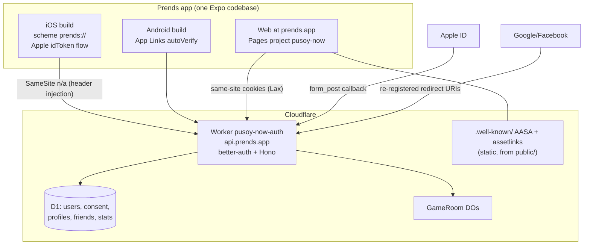
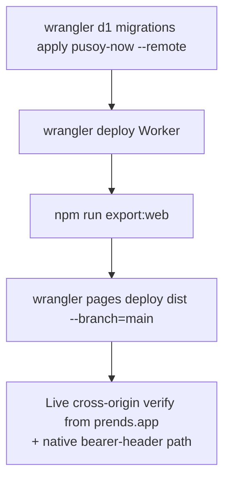

# feat: Prends rebrand + iOS/Android store track

## Summary

Rebrand the app to Prends (prends.app), move the API behind api.prends.app and the web app onto prends.app, and build everything required for store-ready iOS/Android binaries via Expo EAS: Sign in with Apple, in-app account deletion (plus the Google-required web deletion page), lawful marketing-email consent capture, privacy/terms pages, and universal/app links so `/join/CODE` invites open the installed app. v1 ships with no ads and no subscription; the ad banner and paywall UI are hidden while the dormant entitlement plumbing stays.

## Problem Frame

The game is live on the web (pusoy-now.pages.dev) with working auth, friends, and online multiplayer, but it cannot ship to the App Store or Google Play as-is: the brand doesn't match the owned domain, there is no EAS config or store-safe bundle identity, Apple mandates Sign in with Apple once Google/Facebook login exists (guideline 4.8), both stores mandate in-app account deletion, Google additionally requires a web deletion URL, and both stores require a hosted privacy policy. The user also wants an email list built from signups, which must be captured lawfully. Reference checklist: `docs/SHIP-NATIVE.md` (commit it as part of this round).

---

## Requirements

**Rebrand**
- R1. All player-facing branding reads "Prends": app name, home/title strings, settings footer, auth email templates, splash/logo/icon art (the wordmark is baked into `assets/art/logo.png` and `splash.png` via `scripts/gen_assets.py` — regenerate art, not just strings).
- R2. Deep-link scheme becomes `prends://` everywhere it is referenced (client, server, tests), and `prends` is added to the reserved-username lists.
- R3. Permanent store identity is set before first build: `ios.bundleIdentifier` and `android.package` = `app.prends`, `slug` = `prends` (must change before `eas init` links a project).
- R4. Internal infra names stay: Worker `pusoy-now-auth`, Pages project `pusoy-now`, repo name (renaming the Worker orphans its secrets and DO storage).

**Monetization off for v1**
- R5. No ad banner and no paywall entry point is visible anywhere in v1; entitlement plumbing (tables, endpoints, gameCounter, entitlements provider) stays dormant and untouched.

**Email list**
- R6. Email signup shows an UNCHECKED marketing opt-in checkbox, separate from any terms acceptance, never a condition of account creation (pre-ticked boxes are invalid consent under GDPR/CASL; conditioning violates GDPR Art. 7(4)).
- R7. Consent is stored server-side in D1 with a timestamp and source, and is exportable via a documented query.
- R8. Social-login users (Google/Facebook/Apple) get a one-time post-sign-in consent prompt, since they never see the email signup form.

**Store compliance**
- R9. Sign in with Apple is offered on iOS (native idToken flow) and works on web via the redirect flow; the button appears only when the server has Apple credentials (feature-detected like Google/Facebook).
- R10. In-app account deletion: findable in Settings, real deletion of all user rows in D1, signs the user out and wipes local state; when the account has an Apple link, Apple tokens are revoked server-side (Apple requires this).
- R11. A web page at `prends.app/delete-account` lets users delete (or request deletion of) their account without the app installed — required by Google's Data Safety form.
- R12. Privacy policy and terms are live at `prends.app/privacy` and `prends.app/terms` and linked from Settings.

**Domains and links**
- R13. The Worker serves at `https://api.prends.app` (custom domain), `BETTER_AUTH_URL`/`TRUSTED_ORIGINS`/`EXPO_PUBLIC_AUTH_URL` all updated together, Google/Facebook OAuth redirect URIs re-registered on the new domain, and Apple registered against it from day one.
- R14. The web app serves at `https://prends.app` (Pages custom domain); `pusoy-now.pages.dev` keeps working during transition.
- R15. `https://prends.app/join/CODE` opens the installed app (AASA + assetlinks.json served from `public/.well-known/` with correct content-type), falling back to the web page when not installed.

**Build track**
- R16. `eas.json` exists with development/preview/production profiles, remote version source, and production auto-increment; app.json carries every field a store build needs (icon 1024 no-alpha, adaptive icon, associatedDomains, intentFilters, usesAppleSignIn).
- R17. The deploy runbook records the full sequence (remote D1 migrate → Worker deploy → web export → Pages deploy with `--branch=main`) including the `--branch=main` gotcha, which is currently undocumented.

**Verification**
- R18. Round 6 rows are appended to `docs/SECURITY-CHECK.md`; every new `/api/*` route is verified live from the production web origin (the two bug classes only live testing catches: CORS scope, unapplied remote migrations).

---

## Key Technical Decisions

- **Unchecked consent + post-signin prompt (deviation from the confirmed synthesis):** the synthesis proposed a default-checked box; research found pre-ticked boxes are legally invalid consent in the EU/UK/Canada (CJEU Planet49; CRTC guidance), so the list would be unusable there. Unchecked-at-signup plus a one-time post-sign-in prompt for everyone without a consent row is the compliant shape that still maximizes signups (also covers social-login users, R8).
- **Wire `GET /api/providers` into the sign-in screen:** the endpoint exists but no client consumes it — `app/sign-in.tsx` renders a static provider list. Wiring it makes Apple (and future providers) appear exactly when secrets exist, matching the repo's server-side feature-detection convention end to end.
- **Apple native flow = idToken, not browser redirect:** `expo-apple-authentication` returns an identity token whose audience is the app bundle ID; better-auth 1.6 verifies it when `appBundleIdentifier` is configured (without it: "Invalid id token", better-auth issue #7550). The redirect flow has a known release-build hang on iOS (#7049). Web and Android use the Services-ID redirect flow.
- **Bespoke deletion endpoint over better-auth's built-in `deleteUser`:** a `requireUserId`-gated route matches every other custom endpoint in the repo and can purge non-auth tables (consent, verification-by-email) and call Apple revocation in one place. `user` deletion cascades to `session`/`account`/`entitlement`/`player_profile`/`friendship`/`player_stats` (all FKs are `ON DELETE CASCADE`); `verification` rows are keyed by email with no FK and need an explicit delete.
- **Keep Worker + Pages project names, move domains only:** renaming the Worker provisions a fresh Worker without its secrets or DO storage. Custom domains attach to existing services: `routes = [{ pattern = "api.prends.app", custom_domain = true }]` in wrangler.toml; Pages custom domain via dashboard (no wrangler command exists for it).
- **Same-site cookie upgrade:** once web (prends.app) and API (api.prends.app) share a registrable domain, requests are same-site; the SameSite=None cross-site override in `authOptions()` can drop to Lax (better CSRF posture). Keep `credentials: 'include'` on fetches (same-site is not same-origin). Native is unaffected (SecureStore header injection, not browser cookies).
- **AASA served as a real static file with `_headers`:** `public/` ships verbatim into the Pages export and real files win over `_redirects`, but the extensionless AASA file needs `public/_headers` to get `Content-Type: application/json`. Both modern (`appIDs`+`components`) and legacy (`appID`+`paths`) AASA shapes ship for old iOS.
- **assetlinks.json ships with the EAS upload-key fingerprint first, and gains the Play App Signing fingerprint after the first Play upload** (Play re-signs releases; both fingerprints belong in the array).
- **EAS remote versioning:** `appVersionSource: "remote"` + `autoIncrement: true` so buildNumber/versionCode never live in the repo and duplicate-build rejections can't happen.

---

## High-Level Technical Design

Domain and auth topology after this round:

Deploy sequence (every deploy this round, per institutional learnings):

---

## Implementation Units

### U1. Rebrand to Prends (strings, scheme, identity)

- **Goal:** Every player-facing surface and config identity says Prends; infra names stay pusoy-now.
- **Requirements:** R1, R2, R3, R4
- **Dependencies:** none (do first — slug/bundle IDs must precede `eas init` in U9)
- **Files:** `app.json`, `app/_layout.tsx`, `app/index.tsx`, `app/settings.tsx`, `components/AdBanner.tsx` (string only; hidden in U2), `server/src/email.ts`, `lib/authClient.ts` (scheme + storagePrefix), `lib/auth.tsx` (redirectTarget), `app/room/[code].tsx` (deriveJoinLink), `server/src/auth.ts` (APP_SCHEME), `server/src/index.ts` (deepLink), `server/src/index.test.ts` (scheme assertions), `server/src/profile.ts` + `lib/profile.ts` (reserved usernames + `prends`), `package.json`, `server/package.json`, `.claude/launch.json`, `scripts/gen_assets.py` + regenerated `assets/art/logo.png`, `splash.png`, `app-icon.png`, `docs/SHIP-NATIVE.md` (commit it).
- **Approach:** app.json gets `name: "Prends"`, `slug: "prends"`, `scheme: "prends"`, `ios.bundleIdentifier: "app.prends"`, `android.package: "app.prends"`. Scheme + storagePrefix + APP_SCHEME change together (they log native users out — harmless pre-launch, but must be atomic or OAuth round-trips break silently). Art regeneration replaces the wordmark; iOS icon must be 1024×1024 with NO alpha.
- **Test scenarios:** existing `server/src/index.test.ts` deep-link assertions updated to `prends://` and passing; reserved-username test covers `prends` rejected for claim; full client+server suites green.
- **Verification:** grep for `pusoynow`/`Pusoy Now` returns only infra names (Worker, Pages project, D1 db, repo paths) and historical docs.

### U2. Hide ads and paywall for v1

- **Goal:** No monetization UI is reachable; plumbing stays dormant.
- **Requirements:** R5
- **Dependencies:** none
- **Files:** `app/game-local.tsx` (drop AdBanner render + its reserved height row in TablePanel), `app/settings.tsx` (remove "Remove ads" row), `app/_layout.tsx` (paywall screen entry may stay dormant).
- **Approach:** surgical removal of the two render sites; `lib/entitlements.tsx`, `lib/gameCounter.ts`, `lib/entitlementRules.ts`, server Stripe/entitlement routes untouched.
- **Test scenarios:** Test expectation: none — render-only removal; layout checked visually (felt panel reclaims the banner row without clipping the hand).
- **Verification:** game table and settings show no ad/paywall UI at phone width; typecheck green.

### U3. Marketing consent capture

- **Goal:** Lawful, exportable email-list consent for all signup paths.
- **Requirements:** R6, R7, R8
- **Dependencies:** none (server); U1 (labels)
- **Files:** `server/migrations/0005_marketing_consent.sql`, `server/src/consent.ts` (store + pure logic), `server/src/consent.test.ts`, `server/src/index.ts` (POST/GET `/api/consent`, `requireUserId`-gated), `components/ui.tsx` (+ checkbox, `components/ui.test.ts` case), `app/sign-in.tsx` (unchecked box in sign-up form, label "Email me game updates and events — unsubscribe anytime"), `lib/auth.tsx` or `app/index.tsx` (one-time post-sign-in prompt when no consent row), `docs/DEPLOY.md` (export query: `wrangler d1 execute pusoy-now --remote --command "SELECT ..."`).
- **Approach:** table `marketing_consent(userId PK REFERENCES user ON DELETE CASCADE, optIn, source, updatedAt)`. Email signup posts consent right after successful sign-up; social users get a dismissible one-time prompt on first authenticated home render (records opt-in true/false either way so the prompt never repeats).
- **Test scenarios:** upsert records optIn true with timestamp+source; re-submit updates not duplicates; declined prompt records optIn false; unauthenticated POST → 401; deleted user cascades the row (asserted in U4's test).
- **Verification:** consent row visible via the export query after a live signup from the production origin.

### U4. Account deletion (in-app + web page + Apple revocation)

- **Goal:** Real, store-compliant account deletion everywhere.
- **Requirements:** R10, R11
- **Dependencies:** U3 (consent table exists so it can be purged); U8 provides Apple revocation credentials (revocation is feature-detected — ships disabled until Apple secrets exist)
- **Files:** `server/src/deletion.ts` (+ `deletion.test.ts`), `server/src/index.ts` (DELETE `/api/account`), `app/delete-account.tsx` (route works in-app AND at prends.app/delete-account on web), `app/settings.tsx` (Delete account row), `app/_layout.tsx` (screen entry), `lib/auth.tsx` (post-delete local sign-out + SecureStore wipe).
- **Approach:** endpoint resolves the session user, batch-deletes: `verification` rows by the user's email, then the `user` row (cascades session/account/entitlement/profile/friendship/stats/consent). If an `account` row with providerId apple exists and Apple secrets are configured, call Apple's token-revocation REST endpoint first (best-effort, logged). Client screen: explanation of what's deleted, type-to-confirm, then endpoint call, then local sign-out. On web, the same route serves signed-out visitors an explanation + sign-in prompt, satisfying Google's "web deletion URL".
- **Test scenarios:** deleting a user removes every table's rows for that user (fake store asserts user, verification-by-email, consent all gone); deleting a user with friends removes both friendship directions; second delete → 401/404 not a crash; unauthenticated DELETE → 401; apple-linked user triggers revocation call exactly once (fake); revocation failure does not block deletion.
- **Verification:** live: create-and-delete a throwaway account from the production origin, then purge the old `pusoy.qa.round4@gmail.com` QA account through the real flow (SECURITY-CHECK.md already mandates deleting it pre-launch).

### U5. api.prends.app + prends.app domains

- **Goal:** Production domains live; auth survives the move.
- **Requirements:** R13, R14
- **Dependencies:** U1 (scheme changes deploy together)
- **Files:** `server/wrangler.toml` (routes custom_domain, BETTER_AUTH_URL, TRUSTED_ORIGINS), `server/src/auth.ts` (cookie SameSite Lax now that same-site; keep None only if any cross-site origin must keep working), `lib/authClient.ts` (fallback → `https://api.prends.app`), `docs/DEPLOY.md`, `docs/AUTH-SETUP.md` (new redirect URIs).
- **Approach:** `TRUSTED_ORIGINS = "https://prends.app,https://pusoy-now.pages.dev"` during transition. No pre-existing DNS record may sit on api.prends.app (custom-domain creation fails otherwise). Pages custom domain added in the dashboard (registering the domain on the project first — a bare CNAME 522s). Google/Facebook redirect URIs re-registered as `https://api.prends.app/api/auth/callback/<provider>` (operator step with exact console paths in AUTH-SETUP.md). Web re-exported after the Worker URL changes (EXPO_PUBLIC_AUTH_URL bakes at export time).
- **Test scenarios:** Test expectation: none in unit tests — this is config; the live checks below are the tests.
- **Verification:** `curl -sI https://api.prends.app/api/providers` returns 200 with ACAO for prends.app; sign-in from https://prends.app persists a session (cookie Lax); OAuth round-trip works on the new callback URLs; pages.dev origin still functional.

### U6. Universal links + App Links

- **Goal:** `https://prends.app/join/CODE` opens the app.
- **Requirements:** R15
- **Dependencies:** U1 (bundle IDs), U5 (domain live), U9 (Android cert fingerprint from EAS credentials)
- **Files:** `public/.well-known/apple-app-site-association`, `public/.well-known/assetlinks.json`, `public/_headers`, `app.json` (ios.associatedDomains `["applinks:prends.app"]`, android.intentFilters autoVerify https prends.app pathPrefix `/join`).
- **Approach:** AASA carries both modern and legacy shapes with `TEAMID.app.prends` and `/join/*`; expo-router resolves the incoming URL to `app/join/[code].tsx` with no extra wiring. assetlinks starts with the EAS upload-key SHA-256; after first Play upload, append the Play App Signing key fingerprint.
- **Test scenarios:** Test expectation: none — static config; verified live.
- **Verification:** `curl -sI` both files: 200, `application/json`, no redirect; Branch AASA validator passes; (post-build) `adb shell pm get-app-links app.prends` shows verified.

### U7. Privacy policy + terms pages

- **Goal:** Store-ready legal pages, linked in-app.
- **Requirements:** R12
- **Dependencies:** U1 (brand name), U4 (deletion described accurately)
- **Files:** `app/privacy.tsx`, `app/terms.tsx`, `app/_layout.tsx` (screen entries), `app/settings.tsx` (wire the two existing TODO rows).
- **Approach:** plain-English policy covering: data collected (email, display name, user id, game stats, friends), purposes (app functionality; marketing email only with consent), processors (Cloudflare hosting, Google/Facebook/Apple sign-in, Resend email), retention, in-app + web deletion paths, unsubscribe, contact email. Consistent wording with the future App Privacy label / Data Safety form (User Content + Identifiers + Contact Info, no tracking).
- **Test scenarios:** Test expectation: none — static content pages.
- **Verification:** `https://prends.app/privacy` and `/terms` render via SPA fallback; Settings links open them.

### U8. Sign in with Apple

- **Goal:** Apple login on iOS (native) and web, feature-detected.
- **Requirements:** R9
- **Dependencies:** U1 (bundle ID), U5 (api.prends.app registered as the return domain from day one)
- **Files:** `package.json` (+ expo-apple-authentication), `app.json` (plugin, `ios.usesAppleSignIn: true`), `server/src/auth.ts` (apple in `socialProvidersFor` with clientId=Services ID, clientSecret=ES256 JWT, `appBundleIdentifier`; `https://appleid.apple.com` added to trusted origins), `server/src/social.ts` + `social.test.ts` (feature-detection), `lib/auth.tsx` (SocialProvider union + apple native path), `app/sign-in.tsx` (providers list wired to GET `/api/providers`; Apple button iOS+web), `docs/AUTH-SETUP.md` (Apple portal walkthrough: App ID capability, Services ID `app.prends.web` with return URL `https://api.prends.app/api/auth/callback/apple`, .p8 key; client-secret JWT expiry < 6 months, rotation note).
- **Approach:** iOS native: `AppleAuthentication.signInAsync` → `authClient.signIn.social({ provider: 'apple', idToken })`. Web: standard redirect (form_post → callback). Android: no Apple button (guideline 4.8 is Apple-only). Secrets follow the `printf | wrangler secret put` convention: `APPLE_CLIENT_ID`, `APPLE_CLIENT_SECRET`, `APPLE_APP_BUNDLE_IDENTIFIER`.
- **Execution note:** portal artifacts (Services ID, key) are operator steps — document exactly, and keep the code feature-detected so it ships before the secrets exist.
- **Test scenarios:** `socialProvidersFor` includes apple only when all three secrets present; `configuredProviderIds` lists apple then; sign-in screen renders Apple button only when `/api/providers` includes apple (and hides on Android); Apple email-relay note recorded (email claim arrives only on first authorization).
- **Verification:** web Apple sign-in round-trip on the live deploy once secrets are set; iOS native flow verified on the first TestFlight build.

### U9. EAS build track

- **Goal:** Store-ready binaries producible with one command each.
- **Requirements:** R16
- **Dependencies:** U1 (slug/bundle IDs), U6 (linking fields), U8 (entitlement)
- **Files:** `eas.json` (new), `app.json` (extra.eas.projectId via `eas init`), `docs/SHIP-NATIVE.md` (updated with the actual commands + submission steps), `.gitignore` (play service-account json).
- **Approach:** profiles per the researched shape: development (dev client, internal), preview (internal), production (`autoIncrement: true`); `cli.appVersionSource: "remote"`. EAS-managed credentials (Apple distribution cert via the existing Apple account; Android keystore generated and stored by EAS — record the backup warning). First builds: `eas build -p ios --profile production` and `-p android`. Submission is documented but gated on operator steps (ASC app record; Google Play account + closed-test clock).
- **Execution note:** `eas init`/`eas login` and the iOS credential handshake are interactive operator steps — the unit lands config + docs; builds run when the user is at the keyboard.
- **Test scenarios:** Test expectation: none — build config; `npx expo config --type public` parses cleanly as the config sanity check.
- **Verification:** `eas build:configure` accepts the config; a preview iOS build completes on EAS (first real proof).

### U10. Deploy, runbook, and live verification round

- **Goal:** Everything above live and proven on production; ledger updated.
- **Requirements:** R17, R18
- **Dependencies:** U1-U8 (U9 independent of web deploy)
- **Files:** `docs/DEPLOY.md` (`--branch=main` gotcha + full sequence), `docs/SECURITY-CHECK.md` (Round 6 rows).
- **Approach:** deploy in the researched order (remote migrate → Worker → export → Pages `--branch=main`). Live checks from the prends.app origin AND the native bearer-header path where applicable: consent POST, account DELETE (throwaway account + purge the old QA account), providers list, AASA/assetlinks headers, invite link SPA fallback, sign-in cookie behavior post-SameSite change. Online-room drop-out (LEFT TABLE) check done lightweight: open a room with two sessions, close one tab, assert the label + auto-pass on the survivor — no full game play-through.
- **Test scenarios:** SECURITY-CHECK rows: consent endpoint auth-gated (401 anon); deletion auth-gated + full purge verified by re-query; forged-Origin still 403 on new domain; AASA served correctly; OAuth callbacks on new domain.
- **Verification:** all Round 6 SECURITY-CHECK rows PASS; prends.app serves the rebranded app.

---

## Scope Boundaries

**In scope:** everything above.

**Deferred to Follow-Up Work**
- Store listing assets (screenshots, feature graphic, description copy) and the actual App Store / Play submissions + review responses.
- Google Play closed test execution (needs 12+ testers, 14 continuous days — start recruiting immediately; the invite-link multiplayer is the natural hook).
- App Privacy nutrition label / Data Safety form entry (done in the store consoles at submission time; wording pre-agreed in U7).
- Marketing email sending (list export exists; campaigns/ESP integration later).
- Ads (AdMob) and the $9.99 subscription via IAP/RevenueCat — deliberately out of v1.
- Turnstile captcha enablement and the other pending SECURITY-CHECK items (9-11).
- Deleting the legacy `supabase/` tree.

**Outside this product's identity**
- Real-money play or purchasable chips (also keeps the age rating clean: answer "no simulated gambling", declare online user interaction).

---

## Risks & Dependencies

- **Google Play account does not exist yet** — $25 signup + identity verification + the 12-tester/14-day closed test are the schedule-critical path for Android; nothing in this plan blocks on it except final submission.
- **Apple portal artifacts are operator steps** (Services ID, .p8 key, team ID); code ships feature-detected so the round doesn't stall on them.
- **Apple client-secret JWT expires ≤ 6 months** — record a rotation reminder in AUTH-SETUP.md.
- **Scheme/storagePrefix change logs out native sessions** — harmless pre-launch; never repeat post-launch.
- **AASA is CDN-cached by Apple** — path changes propagate slowly to installed apps; get `/join/*` right the first time.
- **assetlinks needs a second fingerprint after first Play upload** (Play App Signing re-signs) — tracked inside U6.
- **Cookie change (None → Lax)** could break any remaining cross-site consumer — the transition TRUSTED_ORIGINS keeps pages.dev working; verify sign-in from both origins before removing None.
- **Every new route is exposed to the two live-only bug classes** (CORS scope, unapplied remote migrations) — U10's sequence exists precisely for this.

---

## Sources & Research

- Repo conventions and touchpoints: repo research pass (feature-detection in `server/src/social.ts`, `requireUserId` gate, `d1XxxStore` + pure-logic test pattern, tsx test chains, `public/` verbatim copy into the Pages export).
- Institutional learnings: `docs/DEPLOY.md` step-0 migrations, `docs/SECURITY-CHECK.md` live-testing doctrine, `docs/AUTH-SETUP.md` secrets convention; the `--branch=main` Pages behavior observed live this session (deploys from a feature branch land in Preview).
- better-auth Apple (idToken + `appBundleIdentifier`, issues #7550/#7049): better-auth.com/docs/authentication/apple, /docs/integrations/expo.
- EAS SDK 57 (remote versions, credentials, icon constraints): docs.expo.dev/build/eas-json, /build-reference/app-versions.
- Universal/App links: docs.expo.dev/linking/ios-universal-links, /linking/android-app-links.
- Cloudflare custom domains: developers.cloudflare.com/workers/configuration/routing/custom-domains, /pages/configuration/custom-domains (no wrangler command for Pages domains; workers-sdk #11772).
- Compliance: Apple guidelines 4.8 + 5.1.1(v) + account-deletion support doc (Apple token revocation), Google Play answers 13327111 (deletion + web URL), 14151465 (12-tester/14-day), 11926878 (target API 35/36), CJEU Planet49 + CRTC CASL guidance (pre-ticked boxes invalid).
