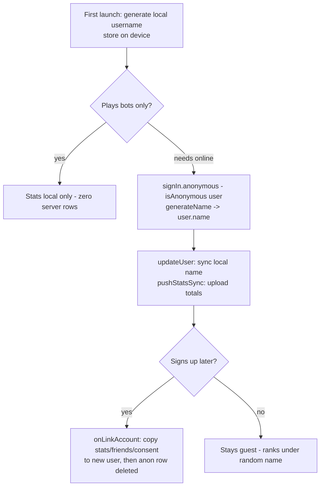

# feat: Guest play, matchmaking, home redesign

## Summary

Make sign-in optional end to end: guests get a Reddit-style random username, can play everything (bots AND online) via better-auth anonymous sessions, appear on the leaderboard, and keep their stats when they later create an account. Play Online becomes a 30-second matchmaking waiting room backed by a new Matchmaker Durable Object (expert bots fill unfilled seats). The home page is redesigned around one hero action with a live "Players Online" counter, a How to Play screen ships, all screens get a mobile pass, and 4 new Prends art assets are generated.

## Problem Frame

Today every online feature demands an account up front, the home page mixes three button systems and stale copy ("Google, Facebook, TikTok"), Play Online requires hosting a room and manually starting it, there are no rules anywhere in the app, and the art still carries the old wordmark. Frictionless first play is the single biggest conversion lever before store launch.

---

## Requirements

**Guest play**
- R1. A first-time visitor can start playing with zero prompts; they are assigned a persistent Reddit-style username (Adjective + Noun + number, e.g. "SwiftNarwhal-4821").
- R2. Guests can use online features (matchmaking, rooms, leaderboard) — an anonymous server session is created lazily at the first action that needs one, never on page load (no junk user rows for drive-by visitors).
- R3. Guest stats (wins, times) count: locally always; on the server leaderboard under their random name once they have an anonymous session.
- R4. Creating a real account (email or social) while playing as a guest carries the guest's stats into the new account; the anonymous identity disappears afterwards.
- R5. The marketing-consent prompt never shows for anonymous sessions.

**Matchmaking**
- R6. "Quick match" puts the player in a waiting room with a visible 30-second countdown; the match starts the moment 4 players pool, otherwise at 30s with expert bots filling every empty seat — including 1 human + 3 expert bots for a lone player.
- R7. Matchmade rooms start automatically (no host start button); the invite-link flow survives as "Play with friends".
- R8. A player can cancel out of the waiting room before the match forms.

**Home + content**
- R9. Home is rebuilt on the design system: one hero primary action, consistent pill buttons, clear hierarchy, "Pusoy Dos" named in the subtitle, stale copy and the off-system nav row/chip removed, dead `app/lobby.tsx` deleted.
- R10. A "Players Online" counter sits top-right on home, driven by a device heartbeat (guests count too).
- R11. A How to Play screen covers Pusoy Dos rules (ranking with suit order C<S<H<D, combos, first-hand lead, passing, winning) plus app tips (tap/drag to play, sort, timers), linked prominently from home.

**Polish + groundwork**
- R12. Mobile pass: all screens usable at 375px, tap targets >=44px, worst offenders fixed (game table fixed widths, room opponent boxes, sign-in).
- R13. Four new art assets generated (logo wordmark, app icon no-alpha, splash, home hero) in the felt-green + gold identity; hard cap 4 generations.
- R14. Ads groundwork is documentation only: an ADS-SETUP doc describing the AdMob path (account, app-ads.txt, SDK config plugin, ATT n/a while ad-free); no SDK ships.
- R15. Everything deploys with the standard sequence (remote D1 migrations -> Worker with DO migration tag v2 -> web export -> Pages --branch=main) and gets live-verified; SECURITY-CHECK.md gains Round 7 rows.

---

## Key Technical Decisions

- **better-auth `anonymous` plugin (already in 1.6.23)** provides guest sessions: server plugin with `generateName` returning the Reddit-style name (written into `user.name`, which the ranking query already reads via its LEFT JOIN fallback — zero leaderboard schema work) and `onLinkAccount` as the merge hook. One hand-written migration adds `user.isAnonymous INTEGER NOT NULL DEFAULT 0` (this repo never runs better-auth's own migrator).
- **Lazy anonymous session, local-first username.** The username is generated on-device at first launch and used immediately for bot play; `signIn.anonymous()` fires only on the first server-needing action, after which the local name is pushed via `updateUser` so server and device agree. Guests who only ever play bots cost zero D1 rows.
- **Merge on link must copy before delete.** better-auth deletes the anonymous user row after linking (cascading its stats), so `onLinkAccount` copies `player_stats` (monotonic-max merge), `friendship`, and `marketing_consent` rows from `anonymousUser.id` to `newUser.id` before the delete lands. Client re-pushes local stats after link as a safety net (the monotonic sync endpoint makes this idempotent).
- **Matchmaker = singleton Durable Object** (`getByName('global')`, new wrangler migration tag `v2` — tags are additive, never reuse v1). Waiting clients hold hibernating WebSockets (near-zero idle cost, instant "match found" push); one storage alarm is recomputed to the earliest queued player's 30s deadline; match formation is a single atomic handler (dequeue, create GameRoom with `botLevel: 'expert'`, notify) so the alarm and a 4th arrival can't race.
- **GameRoom gains an auto-start path**: `RoomState.lobbyDeadline` + a lobby branch in the existing `alarm()` that calls the same `startGame`/`advanceBots`/`afterProgress` sequence when the deadline passes with >=1 human connected — bots fill the rest. Matchmade rooms are created with a short deadline (~8s connect grace) and no host-start requirement; invite rooms keep today's host-only start.
- **Players Online = D1 heartbeat table**, not a DO: `POST /api/presence/beat` upserts `(deviceId, lastSeen)` and returns the current `COUNT(lastSeen > now-90s)` in one round trip; the endpoint is public (guests count before any session) with a UUID shape check. At this scale the writes are effectively free; a DO would be operating overhead for one number.
- **Home redesign stays inside `components/ui.tsx` + `lib/theme.ts`** — the off-system nav row and signed-in chip are replaced with Button/Card compositions (promoting a chip into ui.tsx only if genuinely needed); `app/lobby.tsx` (orphaned, off-theme) is deleted.
- **Art runs through the existing `scripts/gen_assets.py`** (OpenAI key from the Windows registry; the file itself enforces the exactly-4-generations rule): update the logo/app-icon/splash/hero spec prompts to the Prends wordmark, run once with those 4 names. The orchestrator runs generation, not a subagent (external API + budget).
- **`requireEmailVerification` stays on** — the anonymous sign-in endpoint is a separate code path it does not gate (smoke-test at deploy, per research).

---

## High-Level Technical Design

Matchmaking flow (new pieces in bold):

```mermaid
sequenceDiagram
  participant P as Player (guest or account)
  participant W as Worker
  participant M as Matchmaker DO (singleton)
  participant G as GameRoom DO
  P->>W: ensure session (signIn.anonymous if none)
  P->>W: WS /api/matchmaking/ws
  W->>M: forward (X-User-Id, X-Username)
  M-->>P: queued {position, deadline}
  Note over M: alarm = earliest deadline<br/>4 pooled OR 30s elapsed
  M->>G: create(code, 4, firstPlayer, 'expert', lobbyDeadline)
  M-->>P: match {code}
  P->>G: WS /api/rooms/code/ws (join)
  Note over G: starts when all matched humans<br/>connect OR lobbyDeadline passes;<br/>expert bots fill empty seats
```

Guest identity lifecycle:



---

## Implementation Units

### U1. Server: anonymous sessions + guest name + merge hook

- **Goal:** Anonymous sign-in works against the live Worker with generated names and a data-preserving upgrade path.
- **Requirements:** R1, R2, R3, R4, R5
- **Dependencies:** none
- **Files:** `server/migrations/0006_anonymous.sql`, `server/src/guest.ts` (name generator: adjective/noun lists + `generateGuestName(rng)`), `server/src/guest.test.ts`, `server/src/auth.ts` (anonymous plugin wired with `generateName` + `onLinkAccount`), `server/src/linkMerge.ts` (+ `linkMerge.test.ts` — pure copy/merge logic over store fakes), `server/package.json` (test chain).
- **Approach:** plugin is always-on (guest play is core, not feature-detected). `onLinkAccount` uses a store interface (repo pattern) to copy `player_stats` with monotonic-max semantics, `friendship` rows (both directions, skipping duplicates), and `marketing_consent`. Name generator: ~40 adjectives x ~40 nouns x 4-digit suffix; no profanity pairs; deterministic under injected rng for tests.
- **Patterns to follow:** `server/src/social.ts` plugin gating shape, `server/src/consent.ts` store/pure split, migration style of `0005_marketing_consent.sql`.
- **Test scenarios:** generated names match `Adjective` + `Noun` + `-NNNN` and differ across rng seeds; merge copies stats to the new user taking per-bucket max; merge with no anonymous stats is a no-op; duplicate friendship rows are not created; consent row moves; merge failure does not throw out of the hook (logged, link continues).
- **Verification:** server suites green; `signIn.anonymous` smoke-tested live in U10.

### U2. Client: guest identity + optional sign-in everywhere

- **Goal:** Zero-friction first play; sign-in walls replaced by lazy anonymous sessions.
- **Requirements:** R1, R2, R3, R4, R5
- **Dependencies:** U1
- **Files:** `lib/guest.ts` (local username generate/persist; same wordlists — extract shared lists to `lib/guestNames.ts` imported by both sides if trivial, else duplicate with a sync comment), `lib/guestTest.ts`, `lib/authClient.ts` (`anonymousClient()` in plugins for web AND native), `lib/auth.tsx` (`ensureSession()` helper: no session -> `signIn.anonymous()` -> `updateUser({name: localName})` -> `pushStatsSync()`; expose `isAnonymous` from the session user), `app/play-online.tsx` + `app/friends-rank.tsx` + `app/friends.tsx` + `app/join/[code].tsx` (sign-in walls -> `ensureSession()` and proceed), `app/index.tsx` (consent prompt skipped when `isAnonymous`; guest name shown), `app/sign-in.tsx` (copy: guests keep their stats when they sign up), `package.json` test chain.
- **Approach:** guard against re-calling `signIn.anonymous()` when a session already exists (known plugin retry issue); `ensureSession` is idempotent and single-flight. After a real sign-up completes while anonymous, trigger one `pushStatsSync` (safety net on top of U1's server merge).
- **Test scenarios:** local username persists across "restarts" (storage fake); `ensureSession` with existing session is a no-op; consent-prompt gate returns false for anonymous users; join-flow state machine proceeds for a fresh guest.
- **Verification:** a fresh browser profile can tap into matchmaking with no sign-in; guest name visible on home and in rooms.

### U3. Server: Matchmaker DO + GameRoom auto-start

- **Goal:** Quick-match queue with the 30s rule, atomically forming expert-bot-filled rooms.
- **Requirements:** R6, R7
- **Dependencies:** U1 (guests must hold sessions to queue)
- **Files:** `server/src/matchmaker.ts` (DO class), `server/src/matchmakerLogic.ts` (+ `.test.ts` — pure queue/deadline/grouping logic), `server/src/roomLogic.ts` (`lobbyDeadline` in RoomState, `canAutoStart`/auto-start check distinct from host `canStart`), `server/src/room.ts` (create() accepts `{lobbyDeadline, autoStart}`; lobby branch in `alarm()`; start-early when all expected humans connected), `server/src/room.test.ts` (extend), `server/src/index.ts` (`GET /api/matchmaking/ws` session-gated upgrade forwarding identity headers, mirroring the rooms WS route), `server/wrangler.toml` (MATCHMAKER binding + `[[migrations]] tag = "v2" new_sqlite_classes = ["Matchmaker"]`).
- **Approach:** queue entries `{userId, username, joinedAt}` persisted in DO storage; alarm always reset to earliest `joinedAt + 30s`; formation handler (on 4th join or alarm) dequeues up to 4, creates the GameRoom (seats 4, botLevel expert, lobbyDeadline now+8s), pushes `{type:'match', code}` to each socket, closes them. Idempotent alarm (formation re-runs harmlessly on retry). A queued player's socket close removes them from the queue. GameRoom auto-start: lobby alarm fires -> if >=1 human connected, run the existing start sequence; if zero connected humans, discard the room (players never showed).
- **Patterns to follow:** `server/src/room.ts` WS hibernation + serializeAttachment, `roomLogic.ts` pure-logic split, Round-5 room tests.
- **Test scenarios:** 4 joins -> immediate formation with all 4 seated; 2 joins + deadline -> room with 2 humans + 2 expert bot seats; 1 join + deadline -> 1 human room that starts vs 3 expert bots; cancel (socket close) before formation removes the player and never matches them; alarm recomputation after head-of-queue cancels; formation is not duplicated when alarm fires during a concurrent 4th join (single-threaded handler test); auto-start with zero connected humans cleans up; host-start path for invite rooms unchanged (regression).
- **Verification:** unit suites green; live solo quick-match produces a playing room with 3 expert bots after ~30s (U10).

### U4. Client: waiting room + Play Online restructure

- **Goal:** The Quick match UX with countdown, pooled-player list, cancel, and auto-navigation.
- **Requirements:** R6, R7, R8
- **Dependencies:** U2, U3
- **Files:** `app/matchmaking.tsx` (new screen), `lib/matchmakingClient.ts` (+ test for its pure reducer), `app/play-online.tsx` (two cards: "Quick match" -> `/matchmaking`; "Play with friends" -> existing create-room flow), `app/_layout.tsx` (screen entry), `lib/onlineConnection.ts` (reuse/extend the WS state machine if it generalizes cleanly, else a slim sibling).
- **Approach:** screen connects on mount (after `ensureSession`), renders 30 -> 0 countdown from the server-sent deadline (not a local timer), shows "X of 4 players found", Cancel closes the socket and goes back; on `{type:'match'}` navigate to `/room/[code]`. Room screen needs no changes for display — matchmade rooms auto-start server-side.
- **Test scenarios:** reducer transitions queued -> matched -> navigating; cancel mid-queue; deadline reached uses server room code; reconnect/socket-drop mid-queue shows a retry state rather than a stuck spinner.
- **Verification:** live two-browser check optional; minimum bar is the solo 30s bot-fill flow live.

### U5. Players Online counter

- **Goal:** Honest live player count on home.
- **Requirements:** R10
- **Dependencies:** none (parallel-safe)
- **Files:** `server/migrations/0007_presence.sql` (`presence(deviceId TEXT PRIMARY KEY, lastSeen INTEGER NOT NULL)`), `server/src/presence.ts` (+ `.test.ts` — store/pure split: upsert + count window 90s), `server/src/index.ts` (`POST /api/presence/beat` public, UUID-shape-validated body, returns `{count}`), `lib/presence.ts` (device id + `usePresence()` hook: beat on focus + every 45s while foregrounded, exposes count), `lib/presenceTest.ts`, `app/index.tsx` (top-right chip).
- **Approach:** one round trip serves both write and read; count excludes rows older than 90s; opportunistic prune (`DELETE WHERE lastSeen < now-86400`) piggybacks on ~1% of beats.
- **Test scenarios:** beat then count includes device; stale device (lastSeen 5min ago) excluded; same device beating twice counts once; malformed device id rejected 400; prune removes day-old rows only.
- **Verification:** two browsers -> count 2 on both; closing one drops it within ~2 minutes.

### U6. Home redesign + How to Play

- **Goal:** Clear, on-system home with one hero action; rules screen.
- **Requirements:** R9, R11
- **Dependencies:** U2 (guest chip), U5 (counter chip) — mergeable last among UI units
- **Files:** `app/index.tsx` (rebuild), `app/how-to-play.tsx` (new), `app/_layout.tsx` (entry), delete `app/lobby.tsx` (+ its Stack.Screen line), `components/ui.tsx` (only if a chip/stat primitive is genuinely promoted).
- **Approach:** hierarchy top-to-bottom: header row (logo small + Players Online chip top-right), hero (new art), title + subtitle "Pusoy Dos - the Filipino climbing card game", primary Button "Play" (-> bot-select), secondary "Play online", secondary "How to play", then a quiet row/list: Leaderboard, Friends, Scoreboard, Settings (ghost variant, consistent shape), guest/signed-in identity line (guest name + "Sign in to save your progress" / avatar chip), consent card only for non-anonymous sessions. Kill: off-system navBtn styles, "TikTok" copy, "v0.1 vertical slice" footer (use Constants version), Bluetooth entry moves into Settings or the quiet list. How to Play: sectioned Cards — Goal, Card ranking (explicit: 3 lowest -> 2 highest; suits clubs < spades < hearts < diamonds), Your first move, Combos (single/pair/three/five-card table), Passing, Winning, App tips (tap/drag, sort modes, online turn timer 30s). Copy matches the engine's actual rules (verify suit order against `lib/pusoy/deck.ts` SUIT_VALUE, first-lead rule against `newHand`).
- **Test scenarios:** Test expectation: none beyond existing suites -- UI composition; correctness gate is the visual check + copy-vs-engine audit noted above.
- **Verification:** 375px screenshot shows single clear hierarchy; every button is a ui.tsx Button; how-to-play scrolls cleanly.

### U7. Art: 4 Prends assets

- **Goal:** Logo wordmark, app icon, splash, home hero without the old name.
- **Requirements:** R13
- **Dependencies:** prompts editable in parallel; generation gated on U6's layout knowing hero aspect
- **Files:** `scripts/gen_assets.py` (update the `logo`, `app-icon`, `splash`, `hero` spec prompts to the Prends wordmark + current palette), regenerated `assets/art/logo.png`, `app-icon.png`, `splash.png`, `hero.png`.
- **Approach:** orchestrator-run (external API, hard 4-generation budget enforced by the script's own rule): `python scripts/gen_assets.py logo app-icon splash hero`. Key comes from the Windows registry inside the script. Post-check: app-icon has no alpha (node PNG IHDR check used in Round 6). If a result is unusable, do NOT regenerate (budget) — keep the old asset and note it.
- **Test scenarios:** Test expectation: none -- asset generation; gates are the alpha check + visual review.
- **Verification:** home/splash/icon show "PRENDS"; `npx expo config` still resolves; icon alpha check passes.

### U8. Mobile UX pass

- **Goal:** Everything comfortable at 375-430px with >=44px targets.
- **Requirements:** R12
- **Dependencies:** U6 (don't polish the old home)
- **Files:** `app/game-local.tsx` (fixed widths: topBarSide 116, btn minWidths, maxWidth 180 chips — convert to flexible/percentage where safe), `app/room/[code].tsx` (oppBox minWidth 90 x3 at 375px; actionBtn minWidth), `app/sign-in.tsx` + `app/friends.tsx` + `app/bot-select.tsx` (tap targets, spacing audit), others as the audit finds.
- **Approach:** audit first (grep fixed px + screenshot at 375), fix worst offenders, keep diffs surgical; no redesigns — spacing/size/wrap fixes only.
- **Test scenarios:** Test expectation: none -- layout-only; gate is 375px screenshots of game table, room, sign-in with no clipping/overlap.
- **Verification:** screenshots at 375px and 430px for the 4 riskiest screens.

### U9. Ads + launch docs

- **Goal:** Dan can start the AdMob process from a doc; runbooks current.
- **Requirements:** R14
- **Dependencies:** none
- **Files:** `docs/ADS-SETUP.md` (new: AdMob account -> app registration (needs store listing later) -> publisher ID -> `public/app-ads.txt` content to add THEN (placeholder now would be invalid) -> react-native-google-mobile-ads config plugin + test-ads flow -> ATT only when tracking ads arrive -> re-enable AdBanner + entitlement gate), `docs/LAUNCH-STEPS.md` (add ads section pointer + Round 7 notes).
- **Test scenarios:** Test expectation: none -- documentation.
- **Verification:** doc reviewed for accuracy against the dormant AdBanner/entitlement code paths it references.

### U10. Deploy + live verification (orchestrator)

- **Goal:** Round 7 live and proven.
- **Requirements:** R15, plus live proof of R1-R11
- **Dependencies:** U1-U8
- **Files:** `docs/SECURITY-CHECK.md` (Round 7 rows), `docs/DEPLOY.md` (only if sequence changed — v2 DO migration note).
- **Approach:** sequence: `wrangler d1 migrations apply pusoy-now --remote` (0006, 0007) -> `wrangler deploy` (carries DO migration v2) -> `npm run export:web` -> `pages deploy --branch=main`. Live checks (lightweight, no full games): anonymous sign-in from a fresh profile -> guest name on home; presence count moves with two tabs; solo quick match -> room starts by ~30s with 3 expert bots visible (leave immediately); guest appears on ranking with random name; consent endpoints still gated; sign-up-from-guest merges (create throwaway, check stats row moved, then delete account via the existing flow). Google/Facebook OAuth round-trip check (now that secrets exist) — verify redirect works from prends.app.
- **Test scenarios:** the live checks above ARE the scenarios; each becomes a SECURITY-CHECK row (anonymous session cannot access another user's data — spot-check friends endpoints with an anon session).
- **Verification:** all Round 7 SECURITY-CHECK rows PASS; prends.app serves the new home.

---

## Scope Boundaries

**Deferred to Follow-Up Work**
- Turnstile client widget (keys held; wire-up remains a small standalone task — do NOT set the secret until then).
- Ranked/skill-based matchmaking, rematch flows, spectating.
- Ad SDK integration + app-ads.txt (needs AdMob publisher ID; doc ships now).
- Store submission execution (EAS operator steps from LAUNCH-STEPS.md; Team ID + Android fingerprint still owed for universal links).
- The two-account WS redaction check (#18) — still pending from Round 5.
- `app/leaderboard.tsx` vs `friends-rank.tsx` consolidation beyond what the home redesign links to (link the wired one; merging screens is follow-up).

**Outside this product's identity**
- Real-money play, chips, wagering (also keeps age ratings clean).

---

## Risks & Dependencies

- **Anonymous plugin on Expo**: two stale GitHub issues (phone/anon plugin failures, SecureStore cookie drops) reported on old versions, likely fixed by 1.6.23 — U2 must smoke-test native-path storage early; web path is unaffected.
- **onLinkAccount data loss**: the anon user row is deleted after link (cascades stats) — the merge MUST complete inside the hook before returning; test coverage in U1 plus the client-side re-push safety net.
- **DO migration tag v2 is irreversible** — the wrangler change must be exactly additive (`tag = "v2"`, new class only); deploy once, correctly.
- **Public presence endpoint is spoofable** — accepted for v1 (worst case: inflated count); UUID shape check + per-IP rate limiting via the existing better-auth rate limiter is NOT available for custom routes, so keep it dumb and revisit if abused.
- **Art budget is hard-capped at 4** — a bad generation is kept-and-noted, not retried.
- **Lone-player matchmade rooms** produce online games vs 3 expert bots — stats count as online games under current recording rules; acceptable (explicitly per Dan's start rule).

---

## Sources & Research

- better-auth anonymous plugin (config, generateName, onLinkAccount, isAnonymous schema, anon-row deletion after link): better-auth.com/docs/plugins/anonymous; installed `node_modules/better-auth/dist/plugins/anonymous/*` (version 1.6.23 = current latest; no upgrade available or needed). Known issues #4496/#6810/#3658 — retry guard + native smoke test.
- Matchmaker DO design (single alarm per DO, recompute-earliest pattern, hibernating WS billing, atomic formation): developers.cloudflare.com/durable-objects/api/alarms, /best-practices/websockets, /best-practices/rules-of-durable-objects.
- Presence via D1 heartbeat vs DO (cost math at small scale): developers.cloudflare.com/d1/platform/pricing, /durable-objects/platform/pricing.
- Repo ground truth: rooms/WS/identity-header pattern (`server/src/index.ts`, `room.ts`), host-only `canStart` + bot-fill `startGame` (`roomLogic.ts`), ranking name fallback to `user.name` (`server/src/friends.ts` fetchDisplayInfo), monotonic stats sync (`server/src/stats.ts`), consent prompt fires for any session (`app/index.tsx`), off-system home elements + dead `app/lobby.tsx`, `gen_assets.py` registry key + 4-generation rule, fixed-width hotspots (`game-local.tsx`, `room/[code].tsx`).
