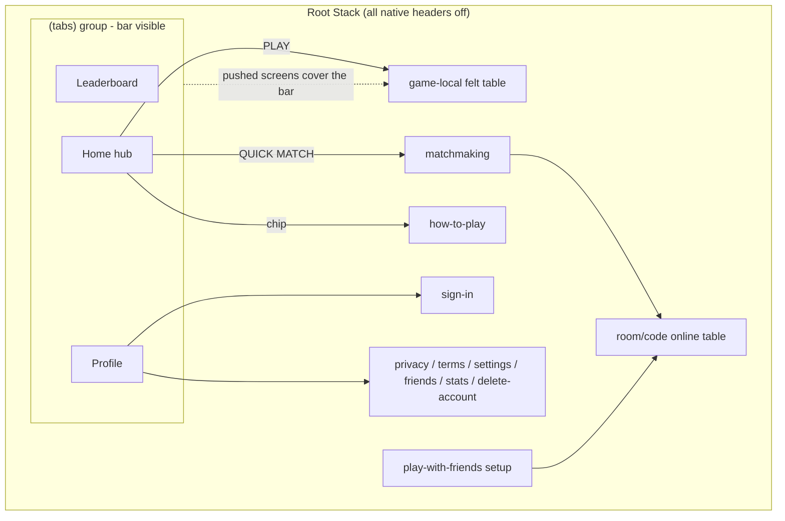
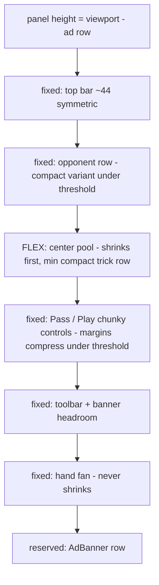

# feat: Duolingo-style UI overhaul + real-device game layout fixes

## Summary

Fix the three real-phone gameplay bugs (Play button pushed off-screen, off-center table, missing ad-banner slot), collapse navigation into a Duolingo-style bottom tab bar (Home / Leaderboard / Profile) with a single always-has-back custom header system, and reskin the app with chunky 3D-edge buttons, a brighter palette, and bold typography — while the felt game table keeps its casino identity. Verified at 360x640 and 412x915 through the deployed bundle.

## Problem Frame

Dan's Android screenshots show the game table overflowing short viewports (Play unreachable, hand clipped, turn banner overlapping Sort), an off-center top bar (Round 7's asymmetric 56/116 side split), no reserved ad space, menu screens that scroll when they should fit one viewport, duplicated headers (native Stack title + in-screen H1), and a rules screen with no back affordance. The overall look reads flat next to the Duolingo reference he wants.

---

## Requirements

**Game table (bugs — fix regardless of skin)**
- R1. On viewports from 360x640 to 430x932, the game table always shows Play, Pass, Sort, the full hand fan, and the top bar without overlap or clipping; the center pool is the only region that shrinks.
- R2. The top bar title/turn-chip is optically centered (symmetric side columns).
- R3. The "Your turn" banner never overlaps the Sort/toolbar row.
- R4. The bottom ad-banner slot is reserved again on the game screen and shows the subtle house placeholder (entitlement-aware AdBanner already exists).

**Navigation**
- R5. Bottom tab bar with three tabs: Home, Leaderboard, Profile; game/flow screens (tables, matchmaking, room setup, sign-in, how-to-play, legal) push full-screen over the tabs with no tab bar visible.
- R6. Exactly one header system: all native headers disabled (both Stack and Tabs layers); a custom compact header with a guaranteed back chevron (falling back to home when there is no history) on every pushed screen. No screen shows a duplicated title.
- R7. Primary screens (Home tab, Play with friends, sign-in) fit one viewport at 360x640 — no scrolling.

**Duolingo-style design system**
- R8. Buttons become chunky and tactile: solid fill + darker 3-4px bottom edge, pressed state translates down and swallows the edge, rounded-xl corners, bold ALL-CAPS labels on primary/secondary/danger variants.
- R9. Palette evolves in the theme (single source): keep felt green/gold/cream identity, add vibrant success green, warm danger red, sky-blue accent, and per-color darker edge tones; cards get soft borders.
- R10. Typography scale gets bolder/larger headings; playful concise microcopy (no em dashes).
- R11. Home becomes a compact hub: identity strip (logo + players online), big PLAY (bots) + QUICK MATCH buttons, How to play chip, and Duolingo-style stat tiles from existing local stats (games played, best win time).
- R12. Profile tab consolidates identity (guest name + sign-in nudge, or account chip), and entries to Settings, Friends, Scoreboard, legal pages.
- R13. The felt table is NOT reskinned — it only receives the layout fixes and the chunky button treatment on its controls.

**Verification**
- R14. All of the above verified in the deployed bundle in a real browser at 360x640 AND 412x915 (R7 lesson: curl and desktop-width checks are insufficient).

---

## Key Technical Decisions

- **Tabs via the `(tabs)` route group** (researched against SDK 57 / expo-router v6 official docs): `app/(tabs)/_layout.tsx` hosts `<Tabs>`; `index`/`leaderboard`/`profile` move inside; every other screen stays a root-Stack sibling and pushes full-screen over the tabs automatically (no config needed to hide the bar). Groups are stripped from URLs, `/` still resolves to the tabs index, and `/join/CODE` + `/room/CODE` deep links are untouched. Web static export is unaffected (single-output SPA + existing `_redirects`).
- **Two header switches, both off**: `headerShown: false` on the root Stack's `(tabs)` entry AND in `Tabs screenOptions` — plus root-Stack-wide — so the new `CompactHeader` component is the only header. Its back action uses router.back() when history exists, else router.replace('/') (fixes the how-to-play dead end).
- **Emoji tab icons** — `tabBarIcon` accepts any React element and `@expo/vector-icons` is not bundled in SDK 57 (and is deprecation-flagged); no icon dependency gets added.
- **Chunky buttons live in the existing token pipeline**: `lib/uiState.ts` `resolveButtonTokens` grows fill/edge/text/pressed tokens per variant (keeps the pure node-testable pattern); `components/ui.tsx` Button renders the edge as `borderBottomWidth` and applies pressed translate via Pressable's style function. Every screen inherits without per-screen edits.
- **Game-table fix is a height budget, not more tweaks**: compute the available column height once (panel height minus reserved ad row); the center pool is the flexing region (can shrink to a compact single-row trick display); below a height threshold, a compact mode tightens opp-row and button margins. Controls and the hand fan are never the shrinking parts. Top bar side columns return to symmetric widths. The turn banner moves into reserved headroom above the toolbar instead of overlapping it.
- **Presence heartbeat becomes focus-gated** on the Home tab via `useFocusEffect` (tabs keep screens mounted on switch; the hook must stop beating when Home blurs).
- **Leaderboard tab = the wired friends-rank experience** moved into the tab; the old `/friends-rank` and `/leaderboard` routes redirect or are removed (one leaderboard, ending the R7 dual-screen ambiguity).

---

## High-Level Technical Design

Navigation topology after the change:

Game-table vertical budget (the R1 fix):

---

## Implementation Units

### U2. Design system v3: chunky tokens + CompactHeader

- **Goal:** The Duolingo button/typography/palette language exists in the token pipeline; one header component with guaranteed back.
- **Requirements:** R6 (component), R8, R9, R10
- **Dependencies:** none (wave 1)
- **Files:** `lib/theme.ts` (vibrant additions + per-color edge tones + typography bump + radii.xl), `lib/uiState.ts` (resolveButtonTokens: fill/edge/text/caps/pressed per variant primary/secondary/danger/ghost), `components/ui.tsx` (Button chunky render with pressed translate; Card soft border; new `CompactHeader` with back-or-home chevron + centered title + optional right slot; keep Field/Checkbox/BigStat working), `components/ui.test.ts` (token cases).
- **Approach:** edge = `borderBottomWidth` 4 (0 when pressed, translateY 4) — pure RN styles, web-safe. ALL-CAPS via textTransform on primary/secondary/danger only; ghost stays sentence case. CompactHeader replaces `Header`; keep a thin `Header` alias exporting CompactHeader so existing imports keep compiling until swept.
- **Patterns to follow:** existing resolveButtonTokens/ui.test.ts pure-token pattern.
- **Test scenarios:** tokens per variant include distinct edge color darker than fill; pressed tokens zero the edge and add offset; ghost variant has no edge and no caps; disabled tokens dim fill and edge together; header back-fallback logic (pure helper: hasHistory false -> home target).
- **Verification:** all suites green; a Button renders visually chunky in the browser.

### U1. Game table layout surgery (felt keeps its soul)

- **Goal:** R1-R4 fixed on real phones; felt controls adopt chunky style.
- **Requirements:** R1, R2, R3, R4, R13
- **Dependencies:** U2 (tokens)
- **Files:** `app/game-local.tsx` (height budget + compact mode + symmetric top bar + banner headroom + AdBanner row restored), `components/AdBanner.tsx` (unchanged render, re-consumed), `app/room/[code].tsx` (LiveTable buttons chunky; quick vertical audit).
- **Approach:** per the HTD budget diagram: `useWindowDimensions().height` drives a `compact` flag (threshold ~700px viewport); pool area gets `flex: 1, minHeight` small; trick cards scale down in compact mode (smaller marginLeft overlap, or scale transform ~0.85); Pass/Play `centerActionBtn` margins drop from 14 to 6 in compact; opp row uses smaller avatars (36) and hides the stack art in compact (count badge stays); top bar sides both 96 with the back chevron inside; turn banner renders inside a reserved 18px headroom strip above the toolbar (no absolute overlap). Reserve `AD_BANNER_HEIGHT + spacing.sm` back out of panelHeight and render `<AdBanner />` below the panel (Round 6 removal reverted deliberately: Dan wants the space back).
- **Execution note:** characterize first — capture 360x640 and 412x915 screenshots of the CURRENT deployed table before changing layout, so the fix is provably an improvement.
- **Test scenarios:** Test expectation: none beyond existing suites (layout-only); the gate is screenshots at 360x640, 412x915, and 800x1100 showing all controls + full hand visible, title centered, banner not overlapping Sort, ad row present.
- **Verification:** the three phone bugs reproduced-then-fixed in browser screenshots at both device sizes.

### U3. Tabs architecture + single header system

- **Goal:** Bottom tab bar in place; native headers gone app-wide; leaderboard unified.
- **Requirements:** R5, R6
- **Dependencies:** U2 (CompactHeader exists)
- **Files:** `app/(tabs)/_layout.tsx` (new: Tabs, chunky bar styled from theme, emoji icons, headerShown false), `app/(tabs)/index.tsx` (moved home, content untouched in this unit), `app/(tabs)/leaderboard.tsx` (friends-rank content relocated), `app/(tabs)/profile.tsx` (new: identity + entries to Settings/Friends/Scoreboard/legal), `app/_layout.tsx` (single `(tabs)` entry, headerShown false stack-wide, remove per-screen title options), `app/friends-rank.tsx` (redirect to /leaderboard tab or delete + update links), `app/leaderboard.tsx` (delete the stub), `app/index.tsx` (deleted after move), `lib/presence.ts` (focus-gate the heartbeat with useFocusEffect).
- **Approach:** exactly the researched pattern; tab bar: cream background, top border, active tint felt green, bold labels, emoji icons (🏠 🏆 👤 via Text). Every pushed screen keeps rendering its own CompactHeader (swept in U5). Home links that moved to Profile disappear from Home in U4.
- **Test scenarios:** routes resolve: `/` -> Home tab, `/leaderboard` -> tab, `/how-to-play` pushes over tabs (no bar), `/join/CODE` unaffected (add a routing note to lib tests only if a pure helper changes; otherwise Test expectation: none — navigation config, verified in browser).
- **Verification:** browser: tab switching preserves each tab's state; game screens show no tab bar; no native header anywhere.

### U4. Home hub + one-viewport screens

- **Goal:** Duolingo-style compact home; primary screens fit 360x640.
- **Requirements:** R7, R11
- **Dependencies:** U2, U3
- **Files:** `app/(tabs)/index.tsx` (hub rebuild), `app/play-online.tsx` (becomes "Play with friends" only - quick match moved to home; rename title/copy; route stays /play-online), `app/sign-in.tsx` (compaction: tighter spacing, one-viewport at 640), `app/matchmaking.tsx` (CompactHeader + chunky), `lib/stats.ts` (read-only consumption for tiles).
- **Approach:** home top-to-bottom: slim identity row (small logo + PresenceChip), two stat tiles (games played, best time from loadStats via BigStat-style tiles; hide when zero games), giant PLAY button (-> bot-select), QUICK MATCH (-> matchmaking), secondary row: PLAY WITH FRIENDS (-> /play-online) + HOW TO PLAY chip. No hero image on heights under ~700px (it was the space hog); small hero strip allowed on tall screens. Guest sign-in nudge moves to Profile tab (out of Home).
- **Test scenarios:** stat-tile formatting pure helper (games/best time -> display strings, hidden-when-empty) in a lib test; the rest is layout verified in browser at 360x640 (no scroll on Home, Play with friends, sign-in).
- **Verification:** 360x640 screenshots of Home/sign-in/play-with-friends with zero scrolling and no clipped controls.

### U5. Header + copy sweep across secondary screens

- **Goal:** Every remaining screen uses CompactHeader once, no duplicate titles, chunky buttons inherited, ALL-CAPS labels where primary.
- **Requirements:** R6, R10
- **Dependencies:** U2, U3
- **Files:** `app/how-to-play.tsx`, `app/privacy.tsx`, `app/terms.tsx`, `app/settings.tsx`, `app/friends.tsx`, `app/stats.tsx`, `app/delete-account.tsx`, `app/bot-select.tsx`, `app/join/[code].tsx`, `app/bluetooth-info.tsx`, `app/paywall.tsx` (dormant but keep compiling).
- **Approach:** mechanical: remove in-screen H1s that duplicate the header, mount CompactHeader with the screen title, verify each screen's primary action reads as one chunky button. No behavior changes.
- **Test scenarios:** Test expectation: none — mechanical UI sweep; suites must stay green (proves no logic touched).
- **Verification:** grep shows no screen renders both a header title and a matching H1; spot-check three screens in browser.

### U6. Deploy + device-size verification (orchestrator)

- **Goal:** Round 8 live and proven at Dan's real sizes.
- **Requirements:** R14
- **Dependencies:** U1-U5
- **Files:** `docs/SECURITY-CHECK.md` (Round 8 note: UI-only round, no new endpoints), memory update.
- **Approach:** no migrations, no worker changes expected: export web -> pages deploy --branch=main; then in-browser at 360x640 AND 412x915: game table (all controls visible, centered, ad row), tabs bar + switching, Home one-viewport, how-to-play back button works on direct load, pushed screens hide the bar. Push branch.
- **Test scenarios:** the checklist above at both sizes.
- **Verification:** screenshots archived in the final report; prends.app serves the new UI.

---

## Scope Boundaries

**Deferred to Follow-Up Work**
- Real AdMob integration (slot is reserved + placeholder only; docs/ADS-SETUP.md governs).
- Mascot/character art and celebration animations (no art budget this round).
- Streaks/quests/XP systems beyond the two local stat tiles.
- Native tab-bar polish passes (haptics, per-platform elevations) until the first EAS build exists.
- Turnstile widget wire-up (still held; unrelated).

**Outside this product's identity**
- Duolingo-izing the felt table itself (R13 explicitly keeps the casino look).

---

## Risks & Dependencies

- **Route moves can break links**: every `router.push('/friends-rank')` and `/leaderboard` reference must be updated when the tab consolidation lands; grep is the gate.
- **Two header layers**: missing either `headerShown: false` switch leaves a stray native header on some screens; verify on at least one tab screen and one pushed screen.
- **Tabs keep screens mounted**: the presence heartbeat must be focus-gated or it beats forever from a backgrounded Home tab.
- **Compact game mode is judgment-heavy**: the opus unit must screenshot-verify rather than trust math; the characterize-first note exists for exactly this.
- **`Header` alias**: removing the old Header outright would break screens mid-wave; the alias keeps waves independent, swept in U5.

---

## Sources & Research

- expo-router v6 / SDK 57 tabs (route group pattern, auto-hidden bar on stack siblings, dual header switches, tabBarIcon accepts any element, @expo/vector-icons not bundled + deprecation-flagged, groups stripped from URLs, useFocusEffect, lazy-mount-then-stay): docs.expo.dev/router/advanced/tabs, /router/basics/common-navigation-patterns, /router/advanced/nesting-navigators, reactnavigation.org/docs/bottom-tab-navigator.
- Real-device bug evidence: Dan's Android screenshots (Play off-screen, banner/Sort overlap, hand clipped; duplicated "Play online" headers; how-to-play without back).
- Root causes from code in-context: fixed ~650px minimum content stack vs ~570px visible height; Round 7 mobile pass introduced asymmetric 56/116 top-bar sides.
- Duolingo reference: Dan's Mobbin sheet (chunky bottom-edge buttons, bottom tabs, stat tiles, bold type).
