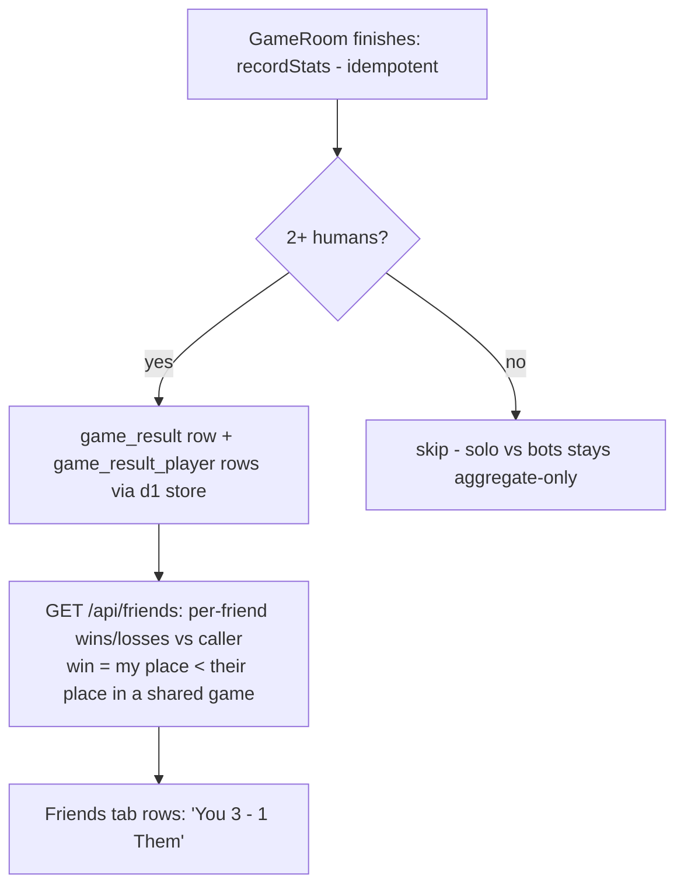
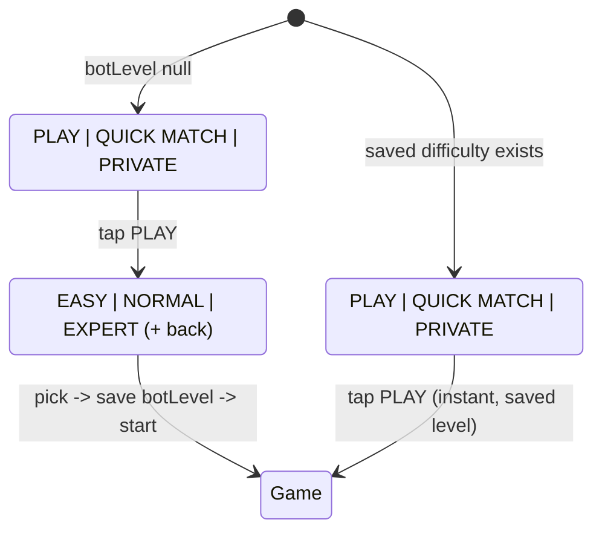

# feat: One-line home actions, instant play, friends head-to-head

## Summary

Home's hero becomes three equal buttons on one line (PLAY | QUICK MATCH | PRIVATE); PLAY starts a bot game instantly with a saved difficulty (EASY | NORMAL | EXPERT appears inline only on first play, changeable in Settings). The game table's center pool cards are never compacted — everything else shrinks on short viewports. Long generated usernames display gracefully everywhere and new guest names are capped. Friends get their own tab with an obvious add flow, request management, and head-to-head W/L per friend backed by new per-game result records on the server.

## Problem Frame

Dan's phone screenshot shows the compact pool rendering as a clipped sliver (the R8 design shrank/clipped pool cards — rejected: cards must stay readable), the guest name truncating in the toolbar, and a home that still carries subtitles and a two-step bot flow. He also had to ask "how do I add a friend?" — the friends feature exists but is buried in the Profile tab with no discoverable add flow and no answer to "how do I do against them?".

---

## Requirements

**Home + play flow**
- R1. Home's action area is exactly three equal buttons on one line: PLAY, QUICK MATCH, PRIVATE — no subtitles.
- R2. First-ever PLAY tap swaps the row inline to EASY | NORMAL | EXPERT; picking one saves it and starts the game immediately. Every later PLAY tap starts instantly with the saved difficulty.
- R3. The saved difficulty is changeable in Settings (EASY | NORMAL | EXPERT row).
- R4. The old two-step bot-select screen is gone from the flow (route redirects or is removed; nothing links to it).

**Game table**
- R5. Center pool cards render FULL SIZE at every viewport — never scaled down, never clipped. On short viewports the space comes from everything else: PASS/PLAY buttons (smaller height/padding), opponent seats, toolbar, and margins.
- R6. All controls remain fully visible and tappable at 360x640 through 430x932 (regression guard on the R8 guarantee).

**Usernames**
- R7. Long names truncate gracefully (ellipsis, no layout breakage, enough space to read a reasonable prefix) in: game toolbar, opponent seat plates, room lobby rows, leaderboard rows, matchmaking count line if names show, profile tab, friends rows.
- R8. Newly generated guest names are at most 14 characters before the -NNNN suffix pair total (i.e. full name <= 19 chars incl. suffix); existing longer names keep working via R7.

**Friends**
- R9. Friends is a 4th bottom tab (👥) with the add flow front and center: prominent ADD FRIEND affordance, add-by-username with inline validation, and a share-my-username hint (guest or account).
- R10. Requests (incoming accept/decline, outgoing cancel) and friend removal are visible and obvious.
- R11. Each friend row shows head-to-head vs you: wins-losses from shared finished online games (a win = placed ahead of the friend in that game).
- R12. Head-to-head works for guests (anonymous users) exactly like accounts.

**Server data**
- R13. Every finished online game with 2+ humans records per-player results (game id, finishing place per human) in D1; recording is idempotent per game (survives alarm retries).
- R14. An endpoint returns the caller's head-to-head record against each of their friends; it is session-gated like every other custom route.

**Delivery**
- R15. Migration 0008 applies to remote D1 BEFORE the Worker deploy; everything verified through the deployed bundle at 360x640 (iframe + DOM geometry method) and a live head-to-head smoke check.

---

## Key Technical Decisions

- **Pool never shrinks — invert the R8 compact model.** R8 made the pool the flexing/shrinking region (Dan rejected the result). Now the pool gets a protected minHeight equal to the full-size trick display (full `PlayingCard` height + caption lines) and everything else compresses on short viewports: compact PASS/PLAY drop to ~36px height with tighter padding and narrower minWidth, the opponent row loses the stack art (keeps avatar + name + count chip), the banner strip and margins tighten. If the budget still cannot fit at 360x570, the OPPONENT row is the next thing to compress (single-line micro seats), never the pool or the hand.
- **Saved difficulty lives in the existing settings pipeline**: `botLevel: BotLevel | null` (null = never chosen) added to `AppSettings` in `lib/settingsRules.ts` (pure, tested) with `lib/settings.ts` persistence untouched in shape. Home reads it: null -> inline picker; set -> straight to `/game-local?bots=3&level=X`. Settings gains the 3-option row writing the same field.
- **Inline picker is a state swap, not a screen**: the action row conditionally renders EASY | NORMAL | EXPERT (same 3-equal-buttons geometry) with a small "Pick your difficulty" caption and a back affordance; no navigation, no new route. `app/bot-select.tsx` becomes a Redirect to `/` (external links keep working).
- **Head-to-head schema = per-game result rows** (richer than pair counters, one write path): `game_result(gameId TEXT PRIMARY KEY, code TEXT, finishedAt INTEGER)` + `game_result_player(gameId TEXT, userId TEXT, place INTEGER, PRIMARY KEY(gameId, userId))`, no FKs to user (results survive account deletion as orphaned rows keyed by dead ids — acceptable; deletion endpoint may optionally purge). Written inside `GameRoom.recordStats()` (already idempotent via `statsRecorded`), humans only, only when 2+ humans participated. Pairwise W/L = for each shared gameId, compare places.
- **Head-to-head rides the existing friends payload**: extend `GET /api/friends` (or a sibling `/api/friends/h2h`) to include `{wins, losses}` per accepted friend computed in one query against the caller — the friends screen already fetches this endpoint, so no extra round trip.
- **Guest name cap in the generator**: `generateGuestName` retries the adjective/noun draw until `adjective.length + noun.length <= 14` (both wordlists have short entries so this terminates fast; deterministic under injected rng by consuming draws in order). Mirrored verbatim in `lib/guestNames.ts` (the documented sync-comment pair).
- **Long-name display is a constraint sweep, not redesign**: every name Text gets `numberOfLines={1}` + `ellipsizeMode="tail"` inside a flex-bounded container (no fixed maxWidth where flex works); rows with trailing controls put the name in `flex: 1` so controls never get pushed off.

---

## High-Level Technical Design

Head-to-head data flow:

Home action-row state machine (directional):

---

## Implementation Units

### U1. Game table: full-size pool, everything else shrinks

- **Goal:** R5/R6 — pool cards always full size; compact mode compresses controls instead.
- **Requirements:** R5, R6
- **Dependencies:** none
- **Files:** `app/game-local.tsx`.
- **Approach:** per the KTD: remove the compact small-card pool (54px path) and the pool-clipping behavior; `trickWrap` gets a protected minHeight for a full-size single-row trick (5 cards overlapped) + caption; compact mode changes become: centerActionBtn height ~36 / paddingVertical down / minWidth ~96, opp row hides OpponentCardStack art in compact (already partially true — verify and tighten further: avatar 32, name row + count chip only), banner strip 14, toolbar margins tightened. Re-derive the budget: verify at 360x570 (Dan's real usable height) that topbar + opp + pool(full) + pass + play + strip + toolbar + hand + ad row fits; if not, compress opp row further (never pool/hand/buttons below 36px tap height... buttons keep >=36 visual with hitSlop to 44 effective).
- **Execution note:** characterize first — reproduce the sliver at 360x570 in the iframe before changing; screenshot after at 360x570, 360x640, 412x915.
- **Test scenarios:** Test expectation: none beyond existing suites (layout-only); gates are the three iframe DOM-geometry checks: pool card height equals the standard CARD_HEIGHT at all sizes; PASS/PLAY/SORT fully visible; effective tap area >= 44 (hitSlop counted).
- **Verification:** iframe geometry shows full-height pool cards at 360x570 with all controls visible.

### U2. Home one-line actions + instant play with saved difficulty

- **Goal:** R1-R4.
- **Requirements:** R1, R2, R3, R4
- **Dependencies:** none (parallel with U1)
- **Files:** `lib/settingsRules.ts` (+ its test file `lib/settingsTest.ts`): `botLevel: BotLevel | null` with merge/back-compat; `app/(tabs)/index.tsx` (action row + inline picker state); `app/settings.tsx` (difficulty row: three chunky option buttons); `app/bot-select.tsx` (-> Redirect to `/`); grep sweep for `/bot-select` links.
- **Approach:** three equal buttons via flexDirection row, each flex 1, ALL-CAPS, no subtitles (PLAY primary, QUICK MATCH secondary/sky, PRIVATE secondary). PLAY handler: `loadSettings()`; botLevel null -> swap row state to picker; else `router.push('/game-local?bots=3&level=' + saved)`. Picker selection: save via `saveSettings`, then navigate. Settings row highlights the current choice and saves immediately.
- **Test scenarios:** settingsRules merge: old stored payload without botLevel loads as null (back-compat); save+load round-trips each level; invalid stored value coerces to null. Home picker logic (extract pure decideOnPlay(saved) -> 'start' | 'pick' helper if nontrivial) covered in the same test file.
- **Verification:** fresh profile: PLAY -> picker -> pick EXPERT -> game starts; return home: PLAY -> instant expert game; Settings shows EXPERT selected; switching to EASY makes next PLAY easy. One-line row fits at 360px.

### U3. Server: per-game results + head-to-head endpoint

- **Goal:** R11-R14 server side.
- **Requirements:** R11, R12, R13, R14
- **Dependencies:** none (parallel)
- **Files:** `server/migrations/0008_game_results.sql`, `server/src/gameResults.ts` (+ `gameResults.test.ts`): store interface + d1 factory + pure `recordGameResult(store, gameId, code, finishedAt, placings)` and `headToHead(store, callerId, friendIds)` returning per-friend {wins, losses}; `server/src/room.ts` (recordStats also writes results when 2+ humans; gameId = the room's hand id or `${code}-${finishedAt}` — pick one stable id available at finish); `server/src/friends.ts` + `server/src/index.ts` (extend the friends payload with h2h per accepted friend); `server/package.json` test chain.
- **Approach:** per the KTD schema. `headToHead`: one query joining game_result_player twice on gameId (caller row + friend row), aggregate wins where caller.place < friend.place. Batch for all friends in one query, not N queries. Friends endpoint shape stays back-compatible (additive field).
- **Test scenarios:** finished game with 3 humans records 3 player rows once (idempotent double-call records once); solo-vs-bots game records nothing; h2h across two shared games where caller placed 1st and 3rd vs friend 2nd/1st -> {wins:1, losses:1}; no shared games -> {0,0}; friend with games vs OTHER people only -> {0,0}; anonymous userIds work identically; existing friends payload fields unchanged (regression).
- **Verification:** server suites green; live smoke in U6.

### U4. Friends tab + overhauled friends screen

- **Goal:** R9-R11 client side.
- **Requirements:** R9, R10, R11, R12
- **Dependencies:** U3 (payload shape)
- **Files:** `app/(tabs)/friends.tsx` (new tab: relocated + redesigned content), `app/(tabs)/_layout.tsx` (4th Tabs.Screen, 👥, between Leaderboard and Profile), `app/friends.tsx` (-> Redirect to `/friends` tab), `app/(tabs)/profile.tsx` (Friends link now points at the tab; keep or drop per space), `lib/friends.ts` (h2h field in types), `lib/friends.test.ts` (type/mapping updates).
- **Approach:** screen order top-down: ADD FRIEND primary button expanding an inline add row (username Field + validation via the existing check endpoint + Add), "Your username: {name} - friends can add you with it" caption (works for guests), Requests section (only when non-empty, accept/decline/cancel chunky small buttons), Friends list: each row = avatar/name (flex 1, ellipsized) + "You W - L" record chip + remove affordance (small ghost, confirm on tap). Empty state: friendly copy + the add flow. ensureSession on mount (guests can do all of this).
- **Test scenarios:** mapping test: friends payload with h2h renders W-L string, missing h2h -> "0 - 0"; add-flow states (idle/checking/invalid/sent) via the existing pure helpers if present (extend lib/friendsMap.ts if that is the pattern).
- **Verification:** browser: add-by-username round trip between two sessions; record chip renders; remove works; tab bar shows 4 tabs at 360px without crowding.

### U5. Long-username sweep + guest name cap

- **Goal:** R7, R8.
- **Requirements:** R7, R8
- **Dependencies:** U1 (game-local toolbar area churn), U4 (friends rows) — run last among UI units
- **Files:** `server/src/guest.ts` + `server/src/guest.test.ts` (length-capped generation), `lib/guestNames.ts` + `lib/guestTest.ts` (mirror), `app/game-local.tsx` (toolbar youName + seat plate names), `app/room/[code].tsx` (lobby + oppName), `app/(tabs)/leaderboard.tsx` (rank rows), `app/(tabs)/profile.tsx`, `app/matchmaking.tsx` (if names render).
- **Approach:** per the KTDs: retry-draw cap in both generators (identical logic + sync comments); display sweep applies numberOfLines/ellipsize + flex-bounded containers; remove fixed maxWidth values where a flex parent can bound instead.
- **Test scenarios:** 500 seeded draws all satisfy combined length <= 14 + suffix shape; determinism preserved for a fixed rng seed; mirror files produce identical output for the same seed (cross-check test in lib/guestTest.ts using the shared expectations).
- **Verification:** a 25-char name (manually set via updateUser) renders ellipsized without breaking any of the six surfaces at 360px.

### U6. Deploy + live verification (orchestrator)

- **Goal:** R15 + live proof.
- **Requirements:** R15
- **Dependencies:** U1-U5
- **Files:** `docs/SECURITY-CHECK.md` (Round 9 rows).
- **Approach:** sequence: `wrangler d1 migrations apply pusoy-now --remote` (0008) -> `wrangler deploy` -> export -> pages `--branch=main`. Live checks: iframe 360x570/360x640 game-table geometry (full pool + controls); home action row one line + picker-first-time flow (fresh profile) + instant-play second time; h2h smoke: two curl sessions befriend each other, simulate is impractical without a game — instead verify the endpoint returns {0,0} for a fresh pair and the friends payload shape; game_result write verified by playing NOTHING (no gameplay rule) — instead unit coverage + a d1 query confirming the empty table exists post-migration. Friends add/accept round trip via curl sessions. Push + memory update.
- **Test scenarios:** the live checklist above; each a ledger row.
- **Verification:** all Round 9 rows PASS; prends.app serves the new home.

---

## Scope Boundaries

**Deferred to Follow-Up Work**
- Head-to-head detail screen (per-friend game history list) — this round ships the W/L chip only.
- Bot-game results in head-to-head (only online multiplayer games count).
- Purging game_result rows on account deletion (orphaned rows are anonymous ids; revisit with a retention pass).
- Seat-count choice for PLAY (fixed 3 bots; PRIVATE flow still offers 2-4 seats).
- The pending two-account WS redaction check (#18).

---

## Risks & Dependencies

- **The 360x570 budget with a full-size pool is tight** — U1's characterize-first + geometry gates are the guard; the fallback compression order (opp row first) is specified so the implementer never re-shrinks the pool.
- **recordStats already does D1 writes in a loop** — adding result writes must not break its best-effort error containment (wrap like the existing per-player try/catch).
- **gameId stability**: must be derivable identically on alarm retries (use the room's existing hand id, not Date.now at write time).
- **4 tabs at 360px** — labels must not wrap; emoji + short labels fit, verify.
- **bot-select removal**: grep-gate all references (home, how-to-play tips mention Sort not routes; check join flows).

---

## Sources & Research

- Repo ground truth (in-session): R8 compact-mode design and its clipping behavior (`trickWrap`, 54px pool path) in `app/game-local.tsx`; `AppSettings`/`mergeSettings` pure split in `lib/settingsRules.ts`; friends screen structure (`AddFriendCard`, `RequestsSection`, action components) in `app/friends.tsx`; idempotent `recordStats` via `statsRecorded` in `server/src/room.ts`; wordlist generator shape in `server/src/guest.ts` + mirror `lib/guestNames.ts`.
- Dan's phone screenshot: pool sliver (rejected R8 clipping design), toolbar name truncation evidence.
- Verification method: same-origin 360-width iframe + DOM geometry (established R8; outer window resize cannot reach true 360px).
